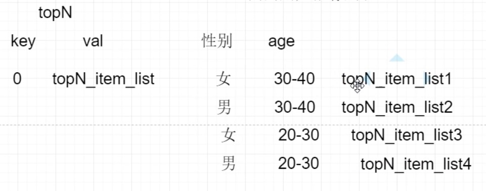
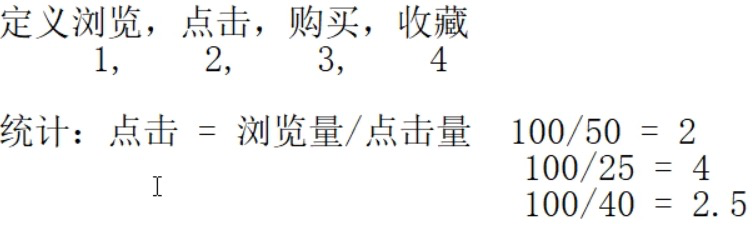
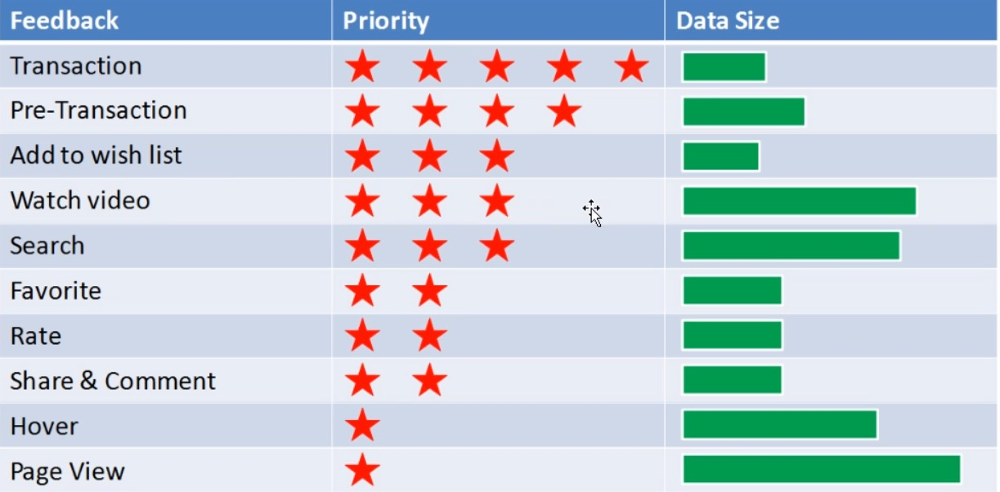
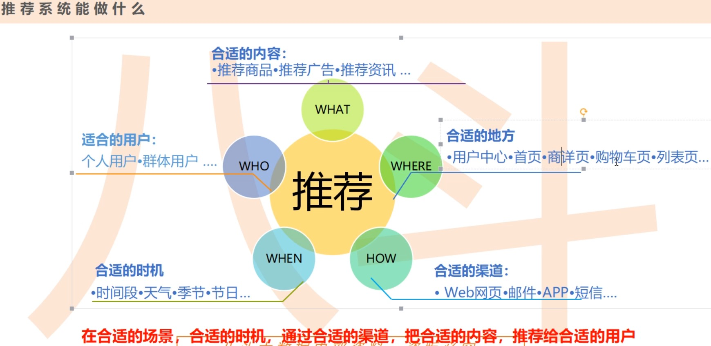
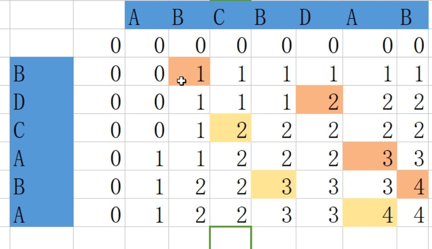

## 推荐系统

解决长尾问题

#### 关注推荐对象的属性

物品：关键字、基因
用户：性别、年龄、地域、工作、消费
用户和物品之间的关系：评分、收藏、购买
推荐：根据上面的关系，进行建模推荐

#### 推荐方式：

基于人口统计：相似用户喜欢相似物品
基于内容推荐：相似内容（物品标签有相似），推荐给同一用户
基于协同过滤推荐：（基于行为）用户A喜欢a,b,c，用户B喜欢a,c，那么推测用户A和B喜好类似，可将b物品推荐给B用户

#### 唯一标识

PC端：cookieid

手机端：imei/imsi

手机浏览器：m端

手机应用：app端

#### 任务：(T+1)

Rating Rrediction 评分预测

Top-N Recommendation Top-N推荐

|  key   |   value   |
| :----: | :-------: |
| 用户ID | item_list |

|    key     |     value      |
| :--------: | :------------: |
| 0 (新用户) | topN_item_list |

区域等等….

统计数值较有意义，后者相对前者有成倍的价值

选择参考

#### 注：

标签的刻画能力 衡量 有些标签比较泛Å

#### NLP相似度

相似度越小，距离越大，越不相似

- 余弦相似度

  - 一个向量空间中两个向量的夹角的余弦值 作为衡量两个个体之前的差异的大小
  - 余弦值接近1，夹角趋于0，表明两个向量越相似
  - 压缩存储 (**稀疏存储**)
  - [0,1,0,0,0,2]   压缩为 1:1 5:2 类似ES的反向索引字典的压缩
    - Python里面称为 scipy
    - Spark里面称为 sparse vector
      - Spark里面的数组形式叫 dense vector
  - 余弦公式

  $$
\cos(\theta)=\frac{\sum_{i=1}^{n}{(x_i *y_i)}}{\sqrt{\sum_{i=1}^n(x_i)^2}*\sqrt{\sum_{i=1}^n(y_i)^2}}
  =\frac{a \cdot b}{\left \| a \right \| * \left \| b \right \|}
  $$
  
  
  
  - 欧氏距离：计算公式
  
  $$
  \sqrt{x_1^2 + x_2^2}
  $$
  
  
  
  - Term weight = tf * idf    **关键词**
  - TF词频率
  
  $$
  TF = \frac{某个文档中词出现的次数}{整个文档的词数}
  $$
  
  or
  $$
  TF = \frac{某个文档中词出现的次数}{整个文档中出现次数最多的词的次数}
  $$
  
  
  - IDF 逆向文档频d率
    - 加1保证分母不为0
    - log压缩值域
  
  $$
  \log{\frac{总文档数}{包含该词的文档数+1}}
  $$
  
  ​	
  
- 空间向量模型

- 自动摘要

  - 文章的信息都包含在句子中，自动摘要就是要找到哪些句子包含的信息最多
  - 信息多：用关键字的数量来衡量，关键字可通过TF-IDF算出
  - 只要关键字之间的距离小于"门阈值"，则认为他们在同一个"簇"内
    - 如果两个关键词之间有 5 个以上的其他词，就可以将这两个关键词分到两个簇
  - 计算每个簇的重要性分值

  $$
  簇的重要性 = \frac{包含的关键词数量^2}{簇的长度}
  $$

  

  - 简化
    - 不再分簇：只考虑句子包含的关键词
  - 待优化

- LCS (longest common subsequence)

  - 最长公共子序列 (有序)

  - 另外简易：Jccard distance  set1 & set2   将句子切词到set中，判断交集

  - 区别最长公共子串 (不可分开的)

  - 求解

    - 穷举：复杂度高
    - 动态规划法

    $$
    LCS(X_m, Y_n) = 
    \begin{cases}
    LCS(X_{m-1},Y_{n-1}) + X_m  & \text 当{X_m=Y_n} \\
    max\{LCS(X_{m-1},Y_n), LCS(X_m,Y_{n-1})\} & \text 当{X_m \neq Y_n}
    \end{cases}
    $$

    

    - 计算：二维数组 $C[m,n]$
      - $C[i,j]$ 记录序列 $X_i$ 和 $Y_j$的最长公共子序列的长度
      - 当i = 0  或 j = 0 时，空的 计为 0
      - 相等：对角+1
      - 不相等：左 - 1 或 上 - 1 取最大值
  - 相等就加，不等就往下传递
    
    $$
    C(i, j) = 
    \begin{cases}
    0 & \text 当 i=0 或 j=0 \\
    C(X_{i-1},Y_{j-1}) + 1  & \text 当i>0, j>0,且{X_i=Y_j} \\
    max\{C(X_{i-1},Y_j), C(X_i,Y_{j-1})\} & \text 当i>0, j>0,且{X_m \neq Y_n}
    \end{cases}
$$
    

拉格朗日

最大似然

叶贝斯公式