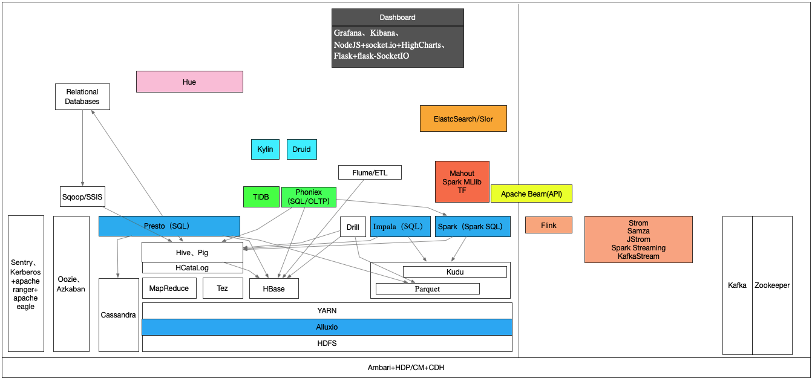

## Conch-Bigdata

> 人人会点大数据！

##### 本项目内容主要以笔记为主，后期如果涉及相关BigData代码，会在个人Github账号中给到Demo.

##### 如果你觉得写得差强人意，麻烦给一个小星星！

#### 简单分类：

> **数据采集**：Flume、Kafka、Scribe、Chukwa
>
> **数据处理**：Hadoop、Spark、Storm、Flink、Pig、Tez、Impala、Presto、Kylin、Drill、Phoniex、Beam、Apex
>
> **数据存储**：HBase、HDFS、Cassandra、Kudu、Alluxio、Parquet
>
> **数据仓库**：Hive、HAWQ
>
> **分布式协调**：Zookeeper
>
> **序列化**：Avro、protobuf、Parquet、apacheORC、Thrift
>
> **数据转移**：Sqoop、SSIS
>
> **集群部署&管理&监控&调度&可视化分析**: Ambari、Yarn、Mesos、业务Quartz、Oozie、Azkaban、Hue
>
> **机器学习&数据挖掘**：Mahout、TF、Spark MLlib、R
>
> **搜索引擎**：Solr, ElasticSearch
>
> **可视化**：Grafana、Kibana、NodeJS+socket.io+HighCharts、Flask+flask-SocketIO
>
> **BI可视化工具**：Redash、CBoard、Apache Superset、Tableau
>
> **数据生命周期管理框架**: Apache Falcon
>
> **安全**：apache Sentry、Knox、Kerberos and Kerberos+apache ranger + apache eagle
>
> **数据流自动化**：apache NiFi
>
> **新型ETL**：NDF
>
> **阿里云对象存储系统**：
>
> **统一编程模型**：Cascading、Apache Crunch、Apache Beam

#### 初步整理：

#### 一句话介绍：

| 组件           | 简介                                                         |
| -------------- | ------------------------------------------------------------ |
| HDFS           | 分布式文件系统                                               |
| Ambari         | 部署、管理、监控Hadoop集群                                   |
| Avro           | 数据序列化系统                                               |
| Cassandra      | 可扩展的多主数据库，无单点故障                               |
| Chukwa         | 用于管理大型分布式系统的数据收集系统                         |
| HBase          | 可扩展的分布式数据库，支持大型表的结构化数据存储             |
| Hive           | 一种数据仓库基础结构，提供数据摘要和即席查询                 |
| Mahout         | 可扩展的机器学习和数据挖掘库                                 |
| Pig            | 用于并行计算的高级数据流语言和执行框架                       |
| Spark          | 适用于Hadoop数据的快速通用计算引擎。 Spark提供了一种简单而富有表现力的编程模型，支持广泛的应用程序，包括ETL，机器学习，流处理和图形计算 |
| Tez            | 一个基于Hadoop YARN的通用数据流编程框架，它提供了一个强大而灵活的引擎来执行任意DAG任务来处理批处理和交互式用例的数据。 Tez正在被Hadoop生态系统中的Hive，Pig和其他框架采用，也被其他商业软件（例如ETL工具）采用，以取代Hadoop MapReduce作为底层执行引擎 |
| Zookeeper      | 适用于分布式应用程序的高性能协调服务                         |
| HCatalog       | HCatalog is a table and storage management layer for Hadoop that enables users with different data processing tools — Pig, MapReduce — to more easily read and write data on the grid. |
| Oozie          | 管理Hadoop作业的工作流调度系统                               |
| Sqoop          | 数据同步，关系型数据库到非关系型数据库                       |
| Flume          | 数据采集                                                     |
| Hue            | Hadoop可视化分析                                             |
| Impala         | 基于Hive并使用内存进行计算，兼顾数据仓库，具有实时、批处理、多并发等优点。实时查询分析引擎。支持列式存储、支持Jdbc/odbc远程访问 |
| Isilon         | EMC Isilon is a distributed filesystem.                      |
| kudu           | enable fast analytics on fast data                           |
| Sentry         | 服务存储身份验证政策元数据并为客户端提供对该元数据的并发安全访问 |
| Solr           | 全文搜索引擎                                                 |
| ElasticSearch  | 全文搜索引擎                                                 |
| Flink          | Apache Flink是一种通用的集群计算工具，可以处理批处理，交互处理，流处理，迭代处理，内存处理，图形处理 |
| Kylin          | Distributed Analytics Engine                                 |
| istio          | Istio lets you connect, secure, control, monitor, and observe services. |
| Alluxio        | 统一结构化大数据                                             |
| Presto         | Distributed SQL Query Engine for Big Data                    |
| Apache Pulsar  | 雅虎开发的企业级发布订阅消息系统                             |
| FreeIPA        | 开源的身份管理系统                                           |
| Azkaban        | 任务调度系统LinkedIn                                         |
| Drill          | Schema-free SQL Query Engine for Hadoop, NoSQL and Cloud Storage |
| Apache Beam    | An advanced unified programming model                        |
| Apache Parquet | 面向分析型业务的列式存储格式                                 |
| Apache ORC     | 列式存储格式                                                 |
| CarbonData     | Apache CarbonData 是一种新的融合存储解决方案，利用先进的列式存储，索引，压缩和编码技术提高计算效率，从而加快查询速度，其查询速度比 PetaBytes 数据快一个数量级 http://carbondata.iteblog.com/ |
| InfluxDB       | InfluxDB是一个由InfluxData开发的开源时序型数据库。 它由Go写成，着力于高性能地查询与存储时序型数据。 InfluxDB被广泛应用于存储系统的监控数据，IoT行业的实时数据等场景。 |
| Akka           | Build powerful reactive, concurrent, distributed, and resilient message-driven applications more easily |
