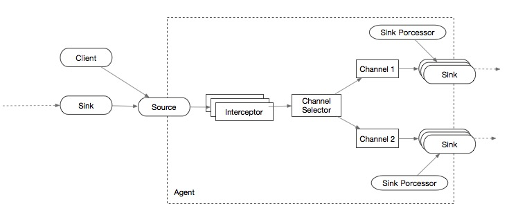

### Apache Flume1.x -> Flume-NG

- Flume将数据流水线中的数据称为 Event

- 每个Event 包含 key/value的头和字节数据的内容两部分

- 字节数组封装实际传递的数据：通常使用Avro，Thrift，Protobuf等对象序列化



#### Source:

- Avro Source、Thrift Source
- Exec Source : 执行指定是Shell，从命令的标准输出中获取数据  很少用：指令出错将无法收集日志 实时性高
- Spooling Directory Source：监控指定目录下的文件的变化 用的多：稳定可靠，实时性差
- Kafka Source：内置Kafka Consumer
- Syslog Source： 分为Syslog TCP Source 和 Syslog UDP Source
- HTTP Source：可接受Http发送过来的数据

选择：

> * 文件数据源：兼顾Exec Source 和 Spooling Directory Source 选择使用 **Taildir Source** TODO
>   * Taildir Source：可实时监控一个目录下的文件变化，实时读取新增数据，并记录断点，保证Agent重启后数据丢失或被重复传输
> * 网络数据源：可选择Avro/Thrift Source，自己编写客户端程序


#### Channel：

- Memery Channel
- File Channel
- JDBC Channel  将Event写入数据库，适合故障恢复要求高的场景
- Kafka Channel 


#### Sink：

- HDFS Sink
- HBase Sink
- Avro/Thrift Sink  RPC方式
- MorphlineSolrSink / ElasticSearchSink 搜索引擎
- Kafka Sink


#### Interceptor:

可修改或过滤Event， 可自定义

- TimeStamp Interceptor ： 在每个Event的头部插入时间戳 key为timestamp，value为当前时间
- Host Interceptor：在每个Event头部插入当前Agent所在机器的host或者ip
- UUID Interceptor：在每个Event头部插入一个128位的全局唯一标识
- Regex Filtering Interceptor：利用正则过滤或者保留符合的Event
- Regex Extractor Interceptor：利用正则提取出对应值并插入头部


#### Channel Selector：

允许Flume Source 选择多个目标Channel

- Replicating Channel Selector：默认，将Event导入多个Channel
- Multiplexing Channel Selector：根据Event头部某个属性值，将Event写入对应Channel


#### Sink Processor：

Flume运行多个Sink组装成一个逻辑实体 Sink Group，Sink Processor为Sink Group提供负载均衡及容错功能

- Default Sink Processor：默认 最简单 Source->Channel->Sink数据流
- Failover Sink Processor：Sink Group中每个Sink被赋予一个优先级，Event优先由高的Sink发送，如果高级的Sink挂了，则选择次高级Sink接替
- Load Balancing Sink Processor：Channel中的Event通过负载均衡机制交由SinkGroup中的所有Sink进行发送：round_robin 和 random 负载均衡机制选择


#### 构建拓扑架构

[官方文档](http://flume.apache.org/releases/content/1.9.0/FlumeUserGuide.html)

##### 下载：

```shell
wget http://mirrors.tuna.tsinghua.edu.cn/apache/flume/1.9.0/apache-flume-1.9.0-bin.tar.gz
```

##### 启动：

```shell
bin/flume-ng agent -n $agent_name -c conf -f conf/flume-conf.properties.template
```

Now the agent will start running source and sinks configured in the given properties file.

##### 配置：

```properties
# example.conf: A single-node Flume configuration

# Name the components on this agent
a1.sources = r1
a1.sinks = k1
a1.channels = c1

# Describe/configure the source
a1.sources.r1.type = netcat
a1.sources.r1.bind = localhost
a1.sources.r1.port = 44444

# Describe the sink
a1.sinks.k1.type = logger
a1.sinks.k1.maxBytesToLog=2000

# Use a channel which buffers events in memory
a1.channels.c1.type = memory
a1.channels.c1.capacity = 1000
a1.channels.c1.transactionCapacity = 100

# Bind the source and sink to the channel
a1.sources.r1.channels = c1
a1.sinks.k1.channel = c1
```

```
运行：
bin/flume-ng agent --conf conf --conf-file example.conf --name a1 -Dflume.root.logger=INFO,console -Dorg.apache.flume.log.printconfig=true -Dorg.apache.flume.log.rawdata=true

测试：
[centos@apollo02 ~]$ telnet localhost 44444
Trying 127.0.0.1...
Connected to localhost.
Escape character is '^]'.
Hello Flume!
OK

结果：
2019-07-12 15:07:26,972 (SinkRunner-PollingRunner-DefaultSinkProcessor) [INFO - org.apache.flume.sink.LoggerSink.process(LoggerSink.java:95)] Event: { headers:{} body: 48 65 6C 6C 6F 20 46 6C 75 6D 65 21 0D          Hello Flume!. }
```

##### 配置细节

```shell
# Here is an example of enabling both configuration logging and raw data logging while also setting the Log4j loglevel to DEBUG for console output:

$ bin/flume-ng agent --conf conf --conf-file example.conf --name a1 -Dflume.root.logger=DEBUG,console -Dorg.apache.flume.log.printconfig=true -Dorg.apache.flume.log.rawdata=true
```


##### HDFS sink

```properties
# It currently supports creating text and sequence files. It supports compression in both file types. The files can be rolled (close current file and create a new one) periodically based on the elapsed time or size of data or number of events. It also buckets/partitions data by attributes like timestamp or machine where the event originated
a1.sources=r1
a1.sinks=k1
a1.channels=c1

a1.sources.r1.type=netcat
a1.sources.r1.bind=localhost
a1.sources.r1.port=44444

a1.sinks.k1.type=hdfs
a1.sinks.k1.hdfs.path=hdfs:/flume/events
a1.sinks.k1.hdfs.filePrefix=events-

a1.sinks.k1.hdfs.round = true
a1.sinks.k1.hdfs.roundValue = 10
a1.sinks.k1.hdfs.roundUnit = minute
# File format: currently SequenceFile, DataStream or CompressedStream 
# (1)DataStream will not compress output file and please don’t set codeC 
# (2)CompressedStream requires set hdfs.codeC with an available codeC
a1.sinks.k1.hdfs.fileType = DataStream
#hdfs.codeC	–	Compression codec. one of following : gzip, bzip2, lzo, lzop, snappy

a1.channels.c1.type=memory
a1.channels.c1.capacity=1000
a1.channels.c1.transactionCapacity=100

a1.sources.r1.channels=c1
a1.sinks.k1.channel=c1

# 官方demo配置
a1.channels = c1
a1.sinks = k1
a1.sinks.k1.type = hdfs
a1.sinks.k1.channel = c1
a1.sinks.k1.hdfs.path = /flume/events/%y-%m-%d/%H%M/%S
a1.sinks.k1.hdfs.filePrefix = events-
a1.sinks.k1.hdfs.round = true
a1.sinks.k1.hdfs.roundValue = 10
a1.sinks.k1.hdfs.roundUnit = minute
# The above configuration will round down the timestamp to the last 10th minute. For example, an event with timestamp 11:54:34 AM, June 12, 2012 will cause the hdfs path to become /flume/events/2012-06-12/1150/00.
```


##### Hive Sink

```properties
# 建表
create table weblogs ( id int , msg string )
    partitioned by (continent string, country string, time string)
    clustered by (id) into 5 buckets
    stored as orc;
 
# 配置 
a1.channels = c1
a1.channels.c1.type = memory
a1.sinks = k1

a1.sinks.k1.type = hive
a1.sinks.k1.channel = c1
a1.sinks.k1.hive.metastore = thrift://127.0.0.1:9083
a1.sinks.k1.hive.database = logsdb
a1.sinks.k1.hive.table = weblogs
a1.sinks.k1.hive.partition = asia,%{country},%y-%m-%d-%H-%M
a1.sinks.k1.useLocalTimeStamp = false

a1.sinks.k1.round = true
a1.sinks.k1.roundValue = 10
a1.sinks.k1.roundUnit = minute

a1.sinks.k1.serializer = DELIMITED
a1.sinks.k1.serializer.delimiter = "\t"
a1.sinks.k1.serializer.serdeSeparator = '\t'
a1.sinks.k1.serializer.fieldnames =id,,msg
```


##### HBase Sink

```properties
a1.channels = c1
a1.sinks = k1

a1.sinks.k1.type = hbase
a1.sinks.k1.table = foo_table
a1.sinks.k1.columnFamily = bar_cf
a1.sinks.k1.serializer = org.apache.flume.sink.hbase.RegexHbaseEventSerializer

a1.sinks.k1.channel = c1
```


##### HBase2 Sink

```properties
a1.channels = c1
a1.sinks = k1

a1.sinks.k1.type = hbase2
a1.sinks.k1.table = foo_table
a1.sinks.k1.columnFamily = bar_cf
a1.sinks.k1.serializer = org.apache.flume.sink.hbase2.RegexHBase2EventSerializer

a1.sinks.k1.channel = c1
```


##### AsyncHBaseSink

```properties
# AsyncHBaseSink can only be used with HBase 1.x
a1.channels = c1
a1.sinks = k1

a1.sinks.k1.type = asynchbase
a1.sinks.k1.table = foo_table
a1.sinks.k1.columnFamily = bar_cf
a1.sinks.k1.serializer = org.apache.flume.sink.hbase.SimpleAsyncHbaseEventSerializer

a1.sinks.k1.channel = c1
```


##### ElasticSearchSink

```properties
a1.channels = c1
a1.sinks = k1

a1.sinks.k1.type = elasticsearch
a1.sinks.k1.hostNames = 127.0.0.1:9200,127.0.0.2:9300
a1.sinks.k1.indexName = foo_index
a1.sinks.k1.indexType = bar_type
a1.sinks.k1.clusterName = foobar_cluster
a1.sinks.k1.batchSize = 500
a1.sinks.k1.ttl = 5d
a1.sinks.k1.serializer = org.apache.flume.sink.elasticsearch.ElasticSearchDynamicSerializer
a1.sinks.k1.channel = c1
```


##### Kafka Sink

```properties
# The Kafka sink also provides defaults for the key.serializer(org.apache.kafka.common.serialization.StringSerializer) and value.serializer(org.apache.kafka.common.serialization.ByteArraySerializer). Modification of these parameters is not recommended.

a1.sinks.k1.channel = c1
a1.sinks.k1.type = org.apache.flume.sink.kafka.KafkaSink
a1.sinks.k1.kafka.topic = mytopic
a1.sinks.k1.kafka.bootstrap.servers = localhost:9092
a1.sinks.k1.kafka.flumeBatchSize = 20
a1.sinks.k1.kafka.producer.acks = 1
a1.sinks.k1.kafka.producer.linger.ms = 1
a1.sinks.k1.kafka.producer.compression.type = snappy
```


##### Avro

```properties
# sender
a1.sources=r1
a1.sinks=k1
a1.channels=c1

a1.sources.r1.type=netcat
a1.sources.r1.bind=localhost
a1.sources.r1.port=44444

a1.sinks.k1.type=avro
a1.sinks.k1.hostname=localhost
a1.sinks.k1.port=1000

a1.channels.c1.type=memory
a1.channels.c1.capacity=1000
a1.channels.c1.transactionCapacity=100

a1.sources.r1.channels=c1
a1.sinks.k1.channel=c1

# receiver
a1.sources= r1
a1.sinks= k1
a1.channels= c1

a1.sources.r1.type= avro
a1.sources.r1.channels= c1
a1.sources.r1.bind= slave3
a1.sources.r1.port= 44444

a1.sinks.k1.type= logger
a1.sinks.k1.channel = c1

a1.channels.c1.type= memory
a1.channels.c1.keep-alive= 10
a1.channels.c1.capacity= 100000
a1.channels.c1.transactionCapacity= 100000
```


##### Exec Source

使用此源时，事件传递绝对没有保证。为了获得更强的可靠性保证，请考虑Spooling Directory Source，Taildir Source或通过SDK直接与Flume集成。

```properties
a1.sources=r1
a1.sinks=k1
a1.channels=c1

a1.sources.r1.type=exec
a1.sources.r1.command=tail -F xxx.log

a1.sinks.k1.type=logger

a1.channels.c1.type=memory
a1.channels.c1.capacity=1000
a1.channels.c1.transactionCapacity=100

a1.sources.r1.channels=c1
a1.sinks.k1.channel=c1
```


##### Spooling Directory Source

```properties
a1.channels = ch-1
a1.sources = src-1

a1.sources.src-1.type = spooldir
a1.sources.src-1.channels = ch-1
a1.sources.src-1.spoolDir = /var/log/apache/flumeSpool
a1.sources.src-1.fileHeader = true
```


##### Taildir Source

```properties
# Note This source is provided as a preview feature. It does not work on Windows.
# It periodically writes the last read position of each files on the given position file in JSON format. If Flume is stopped or down for some reason, it can restart tailing from the position written on the existing position file.
# Currently this source does not support tailing binary files. It reads text files line by line.
a1.sources = r1
a1.channels = c1

a1.sources.r1.type = TAILDIR
a1.sources.r1.channels = c1

a1.sources.r1.positionFile = /var/log/flume/taildir_position.json

a1.sources.r1.filegroups = f1 f2
a1.sources.r1.filegroups.f1 = /var/log/test1/example.log
a1.sources.r1.headers.f1.headerKey1 = value1

a1.sources.r1.filegroups.f2 = /var/log/test2/.*log.*
a1.sources.r1.headers.f2.headerKey1 = value2
a1.sources.r1.headers.f2.headerKey2 = value2-2

a1.sources.r1.fileHeader = true
a1.sources.ri.maxBatchCount = 1000
```


##### Kafka Source

```properties
# The Kafka Source also provides defaults for the key.deserializer(org.apache.kafka.common.serialization.StringSerializer) and value.deserializer(org.apache.kafka.common.serialization.ByteArraySerializer). Modification of these parameters is not recommended.

# 逗号分隔topic
tier1.sources.source1.type = org.apache.flume.source.kafka.KafkaSource
tier1.sources.source1.channels = channel1
tier1.sources.source1.batchSize = 5000
tier1.sources.source1.batchDurationMillis = 2000
tier1.sources.source1.kafka.bootstrap.servers = localhost:9092
tier1.sources.source1.kafka.topics = test1, test2
tier1.sources.source1.kafka.consumer.group.id = custom.g.id

# 正则topic
tier1.sources.source1.type = org.apache.flume.source.kafka.KafkaSource
tier1.sources.source1.channels = channel1
tier1.sources.source1.kafka.bootstrap.servers = localhost:9092
tier1.sources.source1.kafka.topics.regex = ^topic[0-9]$
# the default kafka.consumer.group.id=flume is used
```


##### Kafka Channel

```properties
a1.channels.channel1.type = org.apache.flume.channel.kafka.KafkaChannel
a1.channels.channel1.kafka.bootstrap.servers = kafka-1:9092,kafka-2:9092,kafka-3:9092
a1.channels.channel1.kafka.topic = channel1
a1.channels.channel1.kafka.consumer.group.id = flume-consumer
```


##### File Channel

```properties
a1.channels = c1
a1.channels.c1.type = file
a1.channels.c1.checkpointDir = /mnt/flume/checkpoint
a1.channels.c1.dataDirs = /mnt/flume/data
```


##### other

```properties
# list the sources, sinks and channels in the agent
agent_foo.sources = avro-AppSrv-source1 exec-tail-source2
agent_foo.sinks = hdfs-Cluster1-sink1 avro-forward-sink2
agent_foo.channels = mem-channel-1 file-channel-2

# flow #1 configuration
agent_foo.sources.avro-AppSrv-source1.channels = mem-channel-1
agent_foo.sinks.hdfs-Cluster1-sink1.channel = mem-channel-1

# flow #2 configuration
agent_foo.sources.exec-tail-source2.channels = file-channel-2
agent_foo.sinks.avro-forward-sink2.channel = file-channel-2
```

```properties
# list the sources, sinks and channels in the agent
agent_foo.sources = avro-AppSrv-source1
agent_foo.sinks = hdfs-Cluster1-sink1 avro-forward-sink2
agent_foo.channels = mem-channel-1 file-channel-2

# set channels for source
agent_foo.sources.avro-AppSrv-source1.channels = mem-channel-1 file-channel-2

# set channel for sinks
agent_foo.sinks.hdfs-Cluster1-sink1.channel = mem-channel-1
agent_foo.sinks.avro-forward-sink2.channel = file-channel-2

# channel selector configuration
agent_foo.sources.avro-AppSrv-source1.selector.type = multiplexing
agent_foo.sources.avro-AppSrv-source1.selector.header = State
agent_foo.sources.avro-AppSrv-source1.selector.mapping.CA = mem-channel-1
agent_foo.sources.avro-AppSrv-source1.selector.mapping.AZ = file-channel-2
agent_foo.sources.avro-AppSrv-source1.selector.mapping.NY = mem-channel-1 file-channel-2
agent_foo.sources.avro-AppSrv-source1.selector.default = mem-channel-1

#The selector checks for a header called “State”. If the value is “CA” then its sent to mem-channel-1, if its “AZ” then it goes to file-channel-2 or if its “NY” then both. If the “State” header is not set or doesn’t match any of the three, then it goes to mem-channel-1 which is designated as ‘default’.


```


##### 实战

1. 写文件到指定日志文件
2. flume tail捕获日志信息 sink到kafka
3. kafka source后打印出来

```python
# -*- coding: utf-8 -*-
import random
import time
readFileName="/home/centos/sub/orders.csv"
writeFileName="./flume_exec_test.txt"
with open(writeFileName,'a+')as wf:
    with open(readFileName,'rb') as f:
        for line in f.readlines():
            for word in line.split(" "):
                ss = line.strip()
                if len(ss)<1:
                    continue
                wf.write(ss+'\n')
         #   rand_num = random.random()
            time.sleep(100)
                          
            
#shell 清空文件内容
# echo "" > flume_exec_test.txt
```

```properties
# Name the components on this agent
a1.sources = r1
a1.sinks = k1
a1.channels = c1

# Describe/configure the source
a1.sources.r1.type = exec
a1.sources.r1.command = tail -f /home/centos/sub/flume_exec_test.txt

# 设置kafka接收器 
a1.sinks.k1.type = org.apache.flume.sink.kafka.KafkaSink
# 设置kafka的broker地址和端口号
a1.sinks.k1.kafka.bootstrap.servers=apollo05.dev.zjz:6667,apollo06.dev.zjz:6667,apollo07.dev.zjz:6667
# 设置Kafka的topic
a1.sinks.k1.kafka.topic=flume01
a1.sinks.k1.kafka.flumeBatchSize = 100
# a1.sinks.k1.serializer.class=kafka.serializer.StringEncoder 

# use a channel which buffers events in memory
a1.channels.c1.type=memory
a1.channels.c1.capacity = 100000
a1.channels.c1.transactionCapacity = 100000
a1.channels.c1.byteCapacityBufferPercentage = 20
a1.channels.c1.byteCapacity = 800000

# Bind the source and sink to the channel
a1.sources.r1.channels=c1
a1.sinks.k1.channel=c1
```

```properties

a2.sources = r1
a2.sinks = k1
a2.channels = c1

a2.sources.r1.type = org.apache.flume.source.kafka.KafkaSource
a2.sources.r1.batchSize = 1000
a2.sources.r1.batchDurationMillis = 2000
a2.sources.r1.kafka.bootstrap.servers = apollo05.dev.zjz:6667,apollo06.dev.zjz:6667,apollo07.dev.zjz:6667
a2.sources.r1.kafka.topics = flume01
a2.sources.r1.kafka.consumer.group.id = flume01

#a2.sinks.k1.type = logger
a2.sinks.k1.type = file_roll
a2.sinks.k1.sink.directory = /home/centos/flume/testlog

a2.channels.c1.type=memory
a2.channels.c1.capacity = 100000
a2.channels.c1.transactionCapacity = 100000
a1.channels.c1.byteCapacityBufferPercentage = 20
a1.channels.c1.byteCapacity = 800000

a2.sources.r1.channels=c1
a2.sinks.k1.channel=c1
```

```shell
./bin/flume-ng agent -c conf -f ./conf/kafka_sink.conf -n a1 -Dflume.root.logger=INFO,console

./bin/flume-ng agent -c conf -f ./conf/kafka_source.conf -n a2 -Dflume.root.logger=INFO,console

./kafka-topics.sh --list --zookeeper apollo01.dev.zjz:2181

# 过期
./kafka-consumer-offset-checker.sh --zookeeper apollo01.dev.zjz:2181 --topic flume01 --group flume01 --broker-info
# 过期
./kafka-run-class.sh kafka.tools.ConsumerOffsetChecker --topic flume01 --zookeeper apollo01.dev.zjz:2181 --group  flume01
# 新 查看group下Topic的消费情况
# 新的kafka，偏移信息存储在kafka中
./kafka-consumer-groups.sh --bootstrap-server apollo05.dev.zjz:6667 --describe --group flume01
# 查看kafka数据信息
cd /kafka-logs
```

##### 问题

```
问题描述：
当使用flume-ng进行日志采集的时候，如果日志文件很大，容易导致flume出现：
java.lang.OutOfMemoryError: Java heap space

解决方法：
调整flume相应的jvm启动参数。
修改 flume下的conf/flume-env.sh文件：

export JAVA_OPTS="-Xms512m -Xmx1024m -Dcom.sun.management.jmxremote"
1
其中：

-Xms set initial Java heap size…
-Xmx set maximum Java heap size…

主要修改Xmx和Xms两个参数,可以根据OS内存的大小进行合理设置,一般一个flume agent 1G左右大小即可


问题描述：
org.apache.flume.ChannelFullException: Space for commit to queue couldn't be acquired. Sinks are likely not keeping up with sources, or the buffer size is too tight
调整channel的容量，可替换为kafkachannel
```

