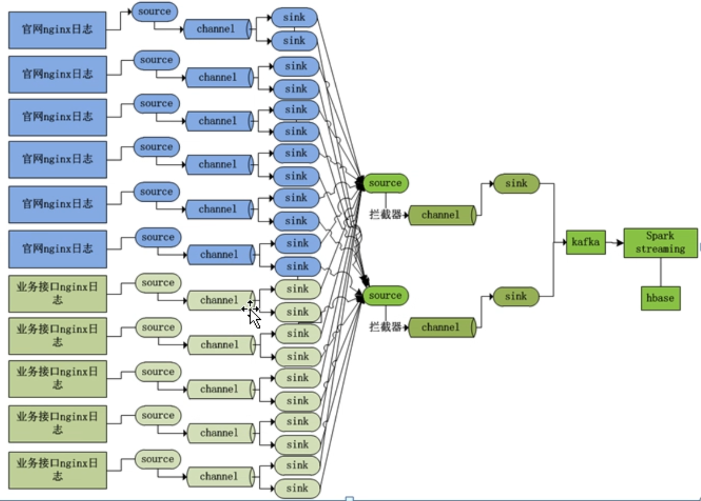

## Flume02 - 高级功能

实际架构：




**Sink组：设置Sink组，同一个Sink组内有多个子Sink，不同Sink之间可以配置成负载均衡或故障转移**

- 负载均衡（load_balance）

  ```shell
  a1.sinkgroups = g1
  # 组内的子Sink
  a1.sinkgroups.g1.sinks = k1 k2
  # 负载均衡
  a1.sinkgroups.g1.processor.type = load_balance
  # 负载均衡下，需设置此值为true，如果Sink失败，则将该Sink放入黑名单
  a1.sinkgroups.g1.processor.backoff = true
  # 失败Sink黑名单驻留时间 指数级增加  单位：ms
  a1.sinkgroups.g1.processor.selector.maxTimeOut = 30000
  # 负载均衡算法 随机 random、轮询 round_robin、或自定义
  a1.sinkgroups.g1.processor.selector = random
  ```

  

- 故障转移

  ```shell
  a1.sinkgroups = g1
  # 组内的子Sink
  a1.sinkgroups.g1.sinks = k1 k2
  # 故障转移
  a1.sinkgroups.g1.processor.type = failover
  # 指定Sink组内各Sink的优先级，数值越大优先级越高
  a1.sinkgroups.g1.processor.priority.k1 = 5
  a1.sinkgroups.g1.processor.priority.k1 = 10
  # 等待失败的Sink恢复的最大时间，默认 30000ms
  a1.sinkgroups.g1.processor.maxpenalty = 5000
  ```

  

- 分层架构

  - 日志采集层
  - 日志聚合层

- 监控重启

- 动态扩缩容

  - sink需要修改负载均衡配置，滚回重启

- Kafka Channel简化架构
  - Source1(日志收集层) -> Kafka Channel -> sink2(日志聚合层)
  - 问题：Kafka的重复消费语义问题