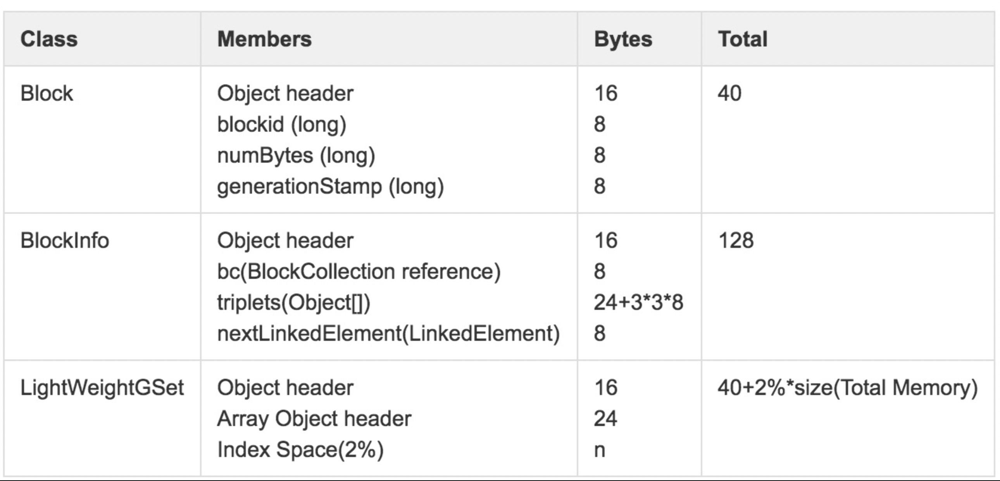

## HDFS深入理解

### Java中常见数据结构占用的内存大小

```
下面先列举下java中常见数据结构占用的内存大小(64bit的jvm)
int = 4 bytes
long = 8 bytes
Reference size(引用) = 8 bytes
Object header size(对象头) = 16 bytes
Array header size(数组头) = 24 bytes
ArrayList header size(list头) = 24(数组头) + 4(属性size的大小) = 28 bytes
TreeMap.Entry = 64 bytes. (Entry的属性中有5个引用)
HashMap.Entry = 48 bytes. (Entry的属性有3个引用)
String header = 64 bytes.
```


> 考了资料如*Hadoop权威指南*、*HADOOP-1687*等，INodeFile、INodeDirectory和BlockInfo对象大小在150~200bytes之间，可以使用150bytes对其内存进行评估


### CMS内存回收算法

TODO:

正常情况下，对超过100GB内存进行回收处理时，可以控制到秒级别的停顿时间，但是如果回收失败被降级到串行内存回收时，应用的停顿时间将达到数百秒，这对应用本身是致命的。


### Hadoop NameNode内存瓶颈解决方案

- 合并小文件：Ozone
- 适量调整Block块大小：默认128M (不过BlockSize调整会间接影响到计算任务，需要进行适当的权衡)
- 扩展NameNode分散单点负载（水平扩展NameNode）： HDFS Federation方案  or Ozone
- 根据元数据增长趋势，参考本文前述的内存空间占用预估方法，能够大体得到NameNode常驻内存大小，一般按照常驻内存占内存总量~60%调整JVM内存大小可基本满足需求。
- 为避免GC出现降级的问题，可将CMSInitiatingOccupancyFraction调整到~70。
- NameNode重启过程中，尤其是DataNode进行BlockReport过程中，会创建大量临时对象，为避免其晋升到Old区导致频繁GC甚至诱发FGC，可适当调大Young区（-XX:NewRatio）到10~15。


#### 网上内存估算方案一

```
问题说明 
HDFS元数据都会存在于Namenode的内存中，因此NameNode的内存大小直接决定了集群支持最大容量，如何估算namenode需要内存大小？

元数据占用内存空间说明 
对象类别 估算大小（bytes） 			计算方法			 			估计总大小（bytes） 
文件      224 						224+2*文件名长度 					250 
目录      264 						264+2*文件名长度 					290 
块 			 152 							152+72*副本数 						368

NameNode元数据内存估算举例 
一个典型集群拥有如下信息 
文件数量：10 600 000 
目录数量：310 000 
块数量：13 300 000

 计算元数据需要内存： 250x 10600000+290x310000 +368x13300000 
     = 7 634 300 000（bytes）≈ 7.63G 

 实际测算：在该NameNode实际使用内存9G。 
 实际计算中内存更大是因为内存中除了元数据还有其他信息。 
```


#### 网上内存估算方案二

```
例子：
NameNode文件和block信息如下：
94115032 files and directories, 91722740 blocks = 185837772 total filesystem object(s).

memSum = 185837772 * 150 bytes = 27875665800bytes = 25.9612368g < 26g

使用jmap命令查看此时NameNode的内存
命令jmap -histo:live pid > mem，输出内存大小为24619484976(22.9286821g，大约23g)
```


#### 美团内存估算方案(2016)

```
NetworkTopology：(相对开销少)
	1. DatanodeDescriptor：(标识DataNode的关键结构)
			假设集群中包括2000个DataNode节点，NameNode维护这部分信息需要占用的内存总量：
				（64 + 114 + 56 + 109 ∗ 16）∗ 2000 = ~4MB
  2. InnerNode(描述机器拓扑结构中机架信息)
  		假设集群包括80个机架和2000个DataNode节点，NameNode维护拓扑结构中内部节点信息需要占用的内存总量：
			  （44 + 48) ∗ 80 + 8 ∗ 2000 = ~25KB
			  
NameSpace：
	假设HDFS目录和文件数分别为1亿，Block总量在1亿情况下，整个Namespace在JVM中内存使用情况：
		Total(Directory) = (24 + 96 + 44 + 48) ∗ 100M + 8 ∗ num(total children) 
		Total(Files) = (24 + 96 + 48) ∗ 100M + 8 ∗ num(total blocks) 
		Total = (24 + 96 + 44 + 48) ∗ 100M + 8 ∗ num(total children) + (24 + 96 + 48) ∗ 100M + 8 ∗ num(total blocks) = ~38GB
	关于预估方法的几点说明： 
		1. 对目录树结构中所有的Directory均按照默认INodeDirectory.withQuotaFeature结构进行估算，如果集群开启ACL/Snapshotd等特性，需增加这部分内存开销。 
		2. 对目录树结构中所有的File按照INodeFile进行估算。 
		3. 从整个目录树的父子关系上看，num(total children)就是目录节点数和文件节点数之和。 
		4. 部分数据结构中包括了字符串，按照均值长度为8进行预估，实际情况可能会稍大。
		
BlockMap:
	LightWeightGSet对应的内存空间全局唯一。尽管经过LightWeightGSet优化内存占用，但是BlocksMap仍然占用了大量JVM内存空间，假设集群中共1亿Block，NameNode可用内存空间固定大小128GB，则BlocksMap占用内存情况：
		16 + 24 + 2% ∗ 128GB +（ 40 + 128 ）∗ 100M = ~20GB

总结：
根据前述对NameNode内存的预估，对比Hadoop集群历史实际数据：文件目录总量~140M，数据块总量~160M，NameNode JVM配置72GB，预估内存使用情况：
	Namespace：(24 + 96 + 44 + 48) ∗ 70M + 8 ∗ 140M + (24 + 96 + 48) ∗ 70M + 8 ∗ 160M = ~27GB 	 BlocksMap：16 + 24 + 2% ∗ 72GB +（ 40 + 128 ）∗ 160M = ~26GB
说明：这里按照目录文件数占比1:1进行了简化，基本与实际情况吻合，且简化对内存预估结果影响非常小。
二者组合结果~53GB，结果与监控数据显示常驻内存~52GB基本相同，符合实际情况。

当可用JVM内存达180GB时，可管理元数据总量达~700000000（7亿），基本能够满足中小规模以下集群需求。

可供参考的NameNode内存数据空间占用预估模型：
	Total = 198 ∗ num(Directory + Files) + 176 ∗ num(blocks) + 2% ∗ size(JVM Memory Size)
```




### NameNode 迁移方案

```
1、思路： 
• Hadoop集群是“机器不相关”(或者IP不相关？)的，无论是那台机器做Namenode，只要配置指向该节点，且该节点文件路径与原Namenode一致，则其他Datanode节点就应该会很傻很天真的以为它就是Namenode节点。 
2、迁移方案举例： 
• 需把 192.168.7.2（hadoop-server1）NameNode迁移到 192.168.7.5 机器上，并保证hadoop集群上的存储数据不被损坏。 
3、修改 192.168.7.5 的主机名为 hadoop-server1 
• 建议使用原先NameNode的主机名，这样可以省去修改集群节点配置文件 
4、vi /etc/hosts 修改所有节点的hosts文件 
• 把192.168.7.2 改成 192.168.7.5 
5、建立SSH 互信 
• 当hadoop-server2用主机名ssh hadoop-server1连接会出现失败，因为hadoop-server2的key记录里hadoop-server1是192.168.7.2，在hadoop-server2执行’ssh-keygen -f “/home/hadoop/.ssh/known_hosts” -R hadoop-server1’命令删除历史数据即可 
6、配置192.168.7.5 JDK环境 
7、从192.168.7.2 远程复制 zookeeper-3.4.8整个目录，7.5路径必须跟7.2保持一致。 
• scp -r /home/hadoop/zookeeper-3.4.8/ hadoop@192.168.7.5:/home/hadoop/ 
8、配置Zookeeper环境变量 
9、从192.168.7.2 远程复制 hadoop-2.4.0整个目录，7.5路径必须跟7.2保持一致。 
• scp -r /home/hadoop/hadoop-2.4.0/ hadoop@192.168.7.5:/home/hadoop/ 
11、配置Hadoop环境变量 
13、启动zookeeper、启动hadoop集群
```


### HDFS数据删除

HDFS中的数据删除也是比较有特点的，并不是直接删除，而是先放在一个类似回收站的地方（/trash），可供恢复。

对于用户或者应用程序想要删除的文件，HDFS会将它重命名并移动到/trash中，当过了一定的生命期限以后，HDFS才会将它从文件系统中删除，并由Namenode修改相关的元数据信息。并且只有到这个时候，Datanode上相关的磁盘空间才能节省出来，也就是说，当用户要求删除某个文件以后，并不能马上看出HDFS存储空间的增加，得等到一定的时间周期以后（现在默认为6小时）。

对于备份数据，有时候也会需要删除，比如用户根据需要下调了Replicaion的个数，那么多余的数据备份就会在下次Beatheart联系中完成删除，对于接受到删除操作的Datanode来说，它要删除的备份块也是先放入/trash中，然后过一定时间后才删除。因此在磁盘空间的查看上，也会有一定的延时。

那么如何立即彻底删除文件呢，可以利用HDFS提供的Shell命令：bin/Hadoop dfs expunge清空/trash。


### HDFS恢复过程

TODO


### 整理总结

> 按文件、目录、Block等比估算：
>
> 大致公式：572*B + 0.02 * M  (B 文件数；M机器内存)
>
> - 3个主控节点；每个节点内存32G
>   - 2个NameNode分布在两台机器上、SNameNode单独一台机器
>   - 预算10G给HDFS
>     - 572*B + 0.02 * 32000 = 10000  => B: 16M ~ 1600 0000  ~ 1600万
>     - 可同时支持1600万文件、1600万目录、1600万Block
>   - 预算20G给HDFS
>     - 572*B + 0.02 * 32000 = 10000 
> - 5个节点；3个节点16G；2个节点32G
>   - 兼顾其他主控程序的运行内存需要： Yarn、Spark
> - 7个节点；4个节点16G；3个节点32G


### 参考

[博客1NameNode内存分析](http://bigdatadecode.club/NameNode%E5%86%85%E5%AD%98%E8%A7%A3%E6%9E%90%E5%8F%8A%E5%A4%A7%E5%B0%8F%E8%AF%84%E4%BC%B0.html)

[博客2NameNode内存分析-美团](https://tech.meituan.com/2016/08/26/namenode.html)

[博客3NameNode内存详解-美团](<https://tech.meituan.com/2016/12/09/namenode-memory-detail.html>)

[博客3HDFS恢复过程](http://bigdatadecode.club/[%E8%AF%91]HDFS%E6%81%A2%E5%A4%8D%E8%BF%87%E7%A8%8B1.html)