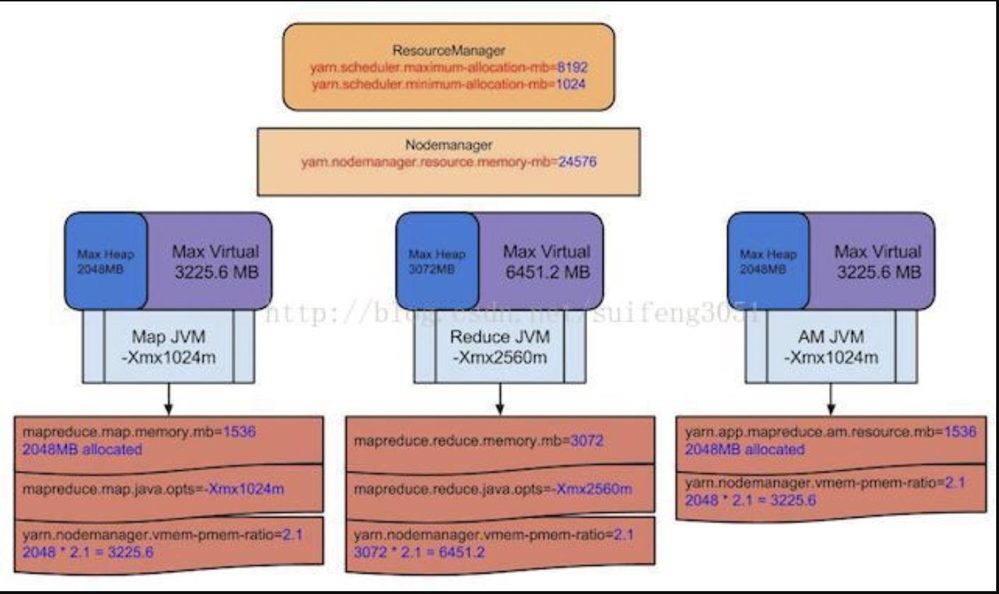
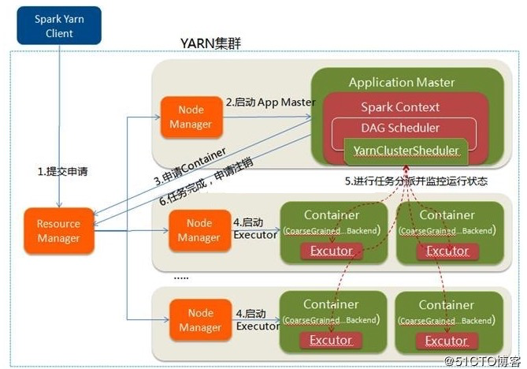

## Yarn深入理解

### 内存配置

#### RM的内存资源配置, 配置的是资源调度相关 

RM1：yarn.scheduler.minimum-allocation-mb 分配给AM单个容器可申请的最小内存 
RM2：yarn.scheduler.maximum-allocation-mb 分配给AM单个容器可申请的最大内存 
注： 

- 最小值可以计算一个节点最大Container数量 
- 一旦设置，不可动态改变

#### NM的内存资源配置，配置的是硬件资源相关 

NM1：yarn.nodemanager.resource.memory-mb 节点最大可用内存 
NM2：yarn.nodemanager.vmem-pmem-ratio 虚拟内存率，默认2.1 
注： 

- RM1、RM2的值均不能大于NM1的值 
- NM1可以计算节点最大最大Container数量，max(Container)=NM1/RM1 
- 一旦设置，不可动态改变 

#### AM内存配置相关参数，配置的是任务相关 

AM1：mapreduce.map.memory.mb 分配给map Container的内存大小 
AM2：mapreduce.reduce.memory.mb 分配给reduce Container的内存大小 

- 这两个值应该在RM1和RM2这两个值之间 
- AM2的值最好为AM1的两倍 
- 这两个值可以在启动时改变 

AM3：mapreduce.map.Java.opts 运行map任务的jvm参数，如-Xmx，-Xms等选项 
AM4：mapreduce.reduce.java.opts 运行reduce任务的jvm参数，如-Xmx，-Xms等选项 
注： 这两个值应该在AM1和AM2之间

### 计算

每两个container使用一块磁盘以及一个CPU核的时候可以使集群的资源得到一个比较好的利用。

YARN以及MAPREDUCE所有可用的内存资源应该要除去系统运行需要的以及其他的hadoop的一些程序

总共保留的内存=系统内存+HBASE内存

参考保留内存

| 每台机子内存 | 系统需要的内存 | HBase需要的内存 |
| ------------ | -------------- | --------------- |
| 4GB          | 1GB            | 1GB             |
| 8GB          | 2GB            | 1GB             |
| 16GB         | 2GB            | 2GB             |
| 24GB         | 4GB            | 4GB             |
| 48GB         | 6GB            | 8GB             |
| 64GB         | 8GB            | 8GB             |
| 72GB         | 8GB            | 8GB             |
| 96GB         | 12GB           | 16GB            |
| 128GB        | 24GB           | 24GB            |
| 255GB        | 32GB           | 32GB            |
| 512GB        | 64GB           | 64GB            |

#### 每台机器container计算:

containers = min (2\*CORES, 1.8*DISKS, (Total available RAM) / MIN_CONTAINER_SIZE)

说明：

- CORES为机器CPU核数
- **DISKS为机器上挂载的磁盘个数**
- Total available RAM为机器总内存
- MIN_CONTAINER_SIZE是指container最小的容量大小，这需要根据具体情况去设置，可以参考下面的表格：

| 每台机子可用的RAM | container最小值 |
| :---------------- | :-------------- |
| 小于4GB           | 256MB           |
| 4GB到8GB之间      | 512MB           |
| 8GB到24GB之间     | 1024MB          |
| 大于24GB          | 2048MB          |

> - 2核4线程 1块磁盘 5G(8G内存) 512M
>   - min(2 * 4, 1.8 * 1, 5000M/512M) = 2

#### 每个container的平均使用内存大小计算方式为：

RAM-per-container = max(MIN_CONTAINER_SIZE, (Total Available RAM) / containers))

> max(512M, 5000M/2) = 2500M

通过上面的计算，YARN以及MAPREDUCE可以这样配置：

| 配置文件              | 配置设置                             | 默认值    | 计算值                           | 8G    |
| :-------------------- | :----------------------------------- | :-------- | :------------------------------- | ----- |
| yarn-site.xml         | yarn.nodemanager.resource.memory-mb  | 8192 MB   | = containers * RAM-per-container | 5000M |
| yarn-site.xml         | yarn.scheduler.minimum-allocation-mb | 1024MB    | = RAM-per-container              | 2500M |
| yarn-site.xml         | yarn.scheduler.maximum-allocation-mb | 8192 MB   | = containers * RAM-per-container | 5000M |
| yarn-site.xml (check) | yarn.app.mapreduce.am.resource.mb    | 1536 MB   | = 2 * RAM-per-container          | 5000M |
| yarn-site.xml (check) | yarn.app.mapreduce.am.command-opts   | -Xmx1024m | = 0.8 * 2 * RAM-per-container    | 4000M |
| mapred-site.xml       | mapreduce.map.memory.mb              | 1024 MB   | = RAM-per-container              | 2500M |
| mapred-site.xml       | mapreduce.reduce.memory.mb           | 1024 MB   | = 2 * RAM-per-container          | 5000M |
| mapred-site.xml       | mapreduce.map.java.opts              |           | = 0.8 * RAM-per-container        |       |
| mapred-site.xml       | mapreduce.reduce.java.opts           |           | = 0.8 * 2 * RAM-per-container    |       |

举个例子：对于128G内存、32核CPU的机器，挂载了7个磁盘，根据上面的说明，系统保留内存为24G，不适应HBase情况下，系统剩余可用内存为104G，计算containers值如下：

containers = min (2*32, 1.8* 7 , (128-24)/2) = min (64, 12.6 , 51) = 13

计算RAM-per-container值如下：

RAM-per-container = max (2, (124-24)/13) = max (2, 8) = 8

使用脚本 [yarn-utils.py ](http://docs.hortonworks.com/HDPDocuments/HDP2/HDP-2.1.1/bk_installing_manually_book/content/rpm-chap1-9.html)来计算上面的值：

这样的话，每个container内存为8G，似乎有点多，我更愿意根据集群使用情况任务将其调整为2G内存，则集群中下面的参数配置值如下：

| 配置文件              | 配置设置                             | 计算值             |
| :-------------------- | :----------------------------------- | :----------------- |
| yarn-site.xml         | yarn.nodemanager.resource.memory-mb  | = 52 * 2 =104 G    |
| yarn-site.xml         | yarn.scheduler.minimum-allocation-mb | = 2G               |
| yarn-site.xml         | yarn.scheduler.maximum-allocation-mb | = 52 * 2 = 104G    |
| yarn-site.xml (check) | yarn.app.mapreduce.am.resource.mb    | = 2 * 2=4G         |
| yarn-site.xml (check) | yarn.app.mapreduce.am.command-opts   | = 0.8 * 2 * 2=3.2G |
| mapred-site.xml       | mapreduce.map.memory.mb              | = 2G               |
| mapred-site.xml       | mapreduce.reduce.memory.mb           | = 2 * 2=4G         |
| mapred-site.xml       | mapreduce.map.java.opts              | = 0.8 * 2=1.6G     |
| mapred-site.xml       | mapreduce.reduce.java.opts           | = 0.8 * 2 * 2=3.2G |

# CPU配置

YARN中目前的CPU被划分成虚拟CPU（CPU virtual Core），这里的虚拟CPU是YARN自己引入的概念，初衷是，考虑到不同节点的CPU性能可能不同，每个CPU具有的计算能力也是不一样的，比如某个物理CPU的计算能力可能是另外一个物理CPU的2倍，这时候，你可以通过为第一个物理CPU多配置几个虚拟CPU弥补这种差异。用户提交作业时，可以指定每个任务需要的虚拟CPU个数。

在YARN中，CPU相关配置参数如下：

- yarn.nodemanager.resource.cpu-vcores：表示该节点上YARN可使用的虚拟CPU个数，默认是8，注意，目前推荐将该值设值为与物理CPU核数数目相同。如果你的节点CPU核数不够8个，则需要调减小这个值，而YARN不会智能的探测节点的物理CPU总数。
- yarn.scheduler.minimum-allocation-vcores：单个任务可申请的最小虚拟CPU个数，默认是1，如果一个任务申请的CPU个数少于该数，则该对应的值改为这个数。
- yarn.scheduler.maximum-allocation-vcores：单个任务可申请的最多虚拟CPU个数，默认是32。

注：

​	4倍于cup-vcores

### Yarn HA

<https://www.zybuluo.com/changedi/note/675439>

<http://hadoop.apache.org/docs/r2.6.4/hadoop-yarn/hadoop-yarn-site/ResourceManagerHA.html>

### 参考

[Hortonworks](<https://docs.hortonworks.com/HDPDocuments/HDP2/HDP-2.1.1/bk_installing_manually_book/content/rpm-chap1-11.html>)

[博客1](<http://blog.javachen.com/2015/06/05/yarn-memory-and-cpu-configuration.html>)

[博客2优化](<http://blog.itpub.net/31558266/viewspace-2216342/>)

[Spark on Yarn](<https://www.jianshu.com/p/f0921a930f9b>)