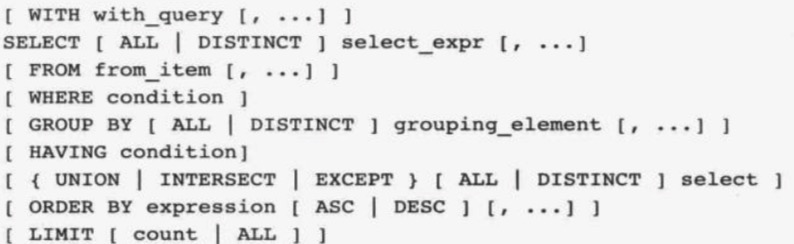
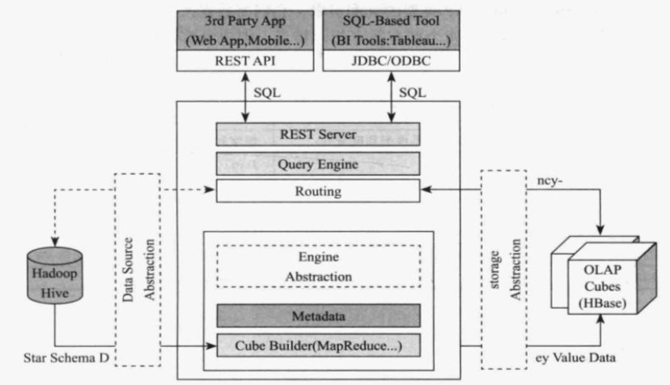
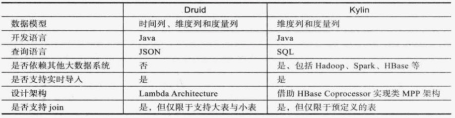

## 交互式计算引擎

### 简介

- OLAP (Online Analytical Processing) ：联机分析处理
  - ROLAP Relational OLAP：基于关系型数据库的OLAP实现
    - 如：Impala、Presto
    - 以关系型数据库为核心，以关系型结构进行多维数据的表示和存储，分为事实表和维度表
    - **个人总结：用关系型结构表示和存储多维数据**
    - 可实时从数据源获取最新数据更新，保证数据的实时性
    - 运算效率低，用户等待时间较长
    - 与Hadoop生态结合好：处理Hive、HDFS、和HBase中的数据
    - MPP架构，扩展性好，能应对TB甚至PB级数据交互式查询需求
    - 嵌套式数据存储：支持常见列式存储格式：Parquet
  - MOLAP Multidimensional OLAP：基于多维数据组织的OLAP实现
    - 如：Druid、Kylin
    - 使用多维数组存储数据
    - 数据立方体(Cube)结构：高度优化，可最大程度提高查询性能
    - 运算效率高，占存储空间大，数据更新延迟
    - 数据建模：将数据分为维度和度量两类，所有查询必须针对上面两类列进行
    - 数据预计算：为提高查询效率，根据维度和度量列，预先生成计算结果
  - HOLAP Hybrid OLAP：基于混合数据组织的OLAP实现
    - 可根据具体业务需求选择哪些模型采用ROLAP，哪些采用MOLAP
    - **一般：不常用或需要灵活定义的分析用ROLAP方式；常用、常规模型采用MOLAP实现**
- MPP (Massively Parallel Processing) ：大规模并行处理

### ROLAP

#### Impala

C++编写

对等式架构：所有角色之间是对等的，没有主从之分

- Catalogd：元数据管理服务
  - 从Hive metastore中同步表信息，将任何元信息的改变通过catalogd广播给各个Impalad服务
  - 一般大数据的元信息很大，Catalogd仅仅加载每张表的概略信息，详细信息由后台进程从第三方存储中延迟载入
- Statestored：状态管理服务
  - 元数据订阅-发布服务
  - 单一实例：存在单点故障
  - 将集群元数据及其修改传播同步到所有Impalad进程
- Impalad：同时承担协调者和执行者双重角色
  - 对与某一查询
    - 作为协调者：接收客户端查询请求，并对其进行词法分析、语法分析、生成逻辑查询计划、生成物理查询计划、将各个执行片段(segement)调度到Impalad上执行
    - 作为执行者：接收从其他Impalad发来的执行片段，利用本地资源(CPU、内存)处理这些片段，将查询结果返回给协调者
  - **Impalad一般部署在集群中运行DataNode进程的所有机器上**，进而利用数据本地化的特点而不必通过网络传输即可从文件系统读取数据块

#### Presto

Facebook开源，与Hive无缝集成

Master-Slave架构

- Coordinator
  - 协调者：接收客户端查询请求，词法分析、语法分析、生成逻辑查询计划、生成物理查询计划，将任务调度到Worker上执行，并汇总Worker返回结果
  - 可存在多个，避免单点故障
- Discovery Server
  - 服务发现组件：各Worker启动时会向Discovery Server注册，并定期向其汇报状态
  - 轻量级服务，嵌入在Coordinator
- Worker
  - 任务执行者：接收来自Coordinator的任务，采用多线程并行执行，将结果返回给Coordiator

支持多种数据源：采用插件方式支持(Connector插件；Hive、HDFS、MySQL、Cassandra、HBase、Redis等)

为区分各个数据源中的数据，在数据库之上引入一层命名空间：catalog

Hive、MySQL等上面提到的都以catalog的方式存在，不同的catalog中可以有多个数据库，每个数据库又可有多个数据表

##### SQL

支持大部分SQL语法：SELECT、CREATE、DELETE、ALTER、DROP等

Select语法：

支持五中Join操作：

内连接、左外连接、右外连接、全外连接、笛卡尔积；还支持cube和rollup等数据仓库操作

### MOLAP

预计算：空间换时间

#### Druid

基于列存储

- Segment：数据强制按照时间分割成不同的数据段
  - 一个Segment包含时间戳、维度(dimension)、度量(metric) 列
- 架构
  - 实时线
  - 批处理线
- 依赖
  - Zookeeper：分布式协调
  - Metadata Storage：存储集群数据信息和相关规则
  - Deep Storage：存放备份数据

#### Kylin

- REST Server：提供一些RESTful接口，例如创建cube、构建cube、刷新cube、合并cube等cube相关操作；元数据管理；用户访问权限；系统配置动态修改等
- JDBC/ODBC接口：使用JDBC接口的查询和使用RESTful接口的查询内部实现流程是相同的；可兼容BI工具
- Query引擎：使用开源的Calcite框架实现SQL解析
- Routing：负责将SQL生成的执行计划转换为面向cube缓存的查询；cube是通过预计算缓存在HBase中，这些查询只需要从HBase中获取查询结果即可返回
- Metadata：元信息包括cube的定义、星状模型的定义、作业的信息、作业的输出信息、维度的存放目录信息等；元信息和cube都存储在HBase中
- Cube构建引擎：负责预计算方式构建cube，通过MapReduce/Spark计算生成HTable然后加载到HBase中

