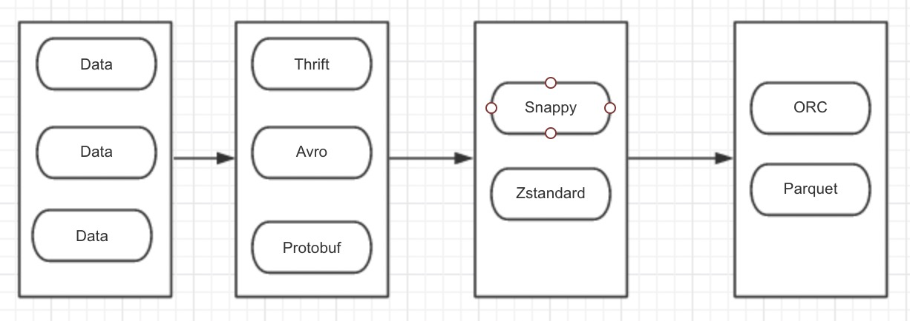

## 数据存储模式

### 数据存储格式

列式：

​	Parquet

​	ORC

​	文件

​	Sequence文件

### 数据压缩算法

考虑压缩速度和压缩文件的可分割性

推荐Snappy

新实时压缩：Zstandard

### 数据序列化

​	Avro

​	Protobuf

​    Thrift	

关系：Snappy压缩算法将二进制流（AvroIO）压缩成Parquet文件

