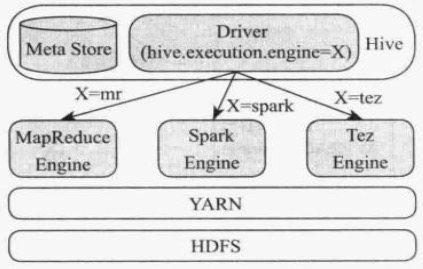
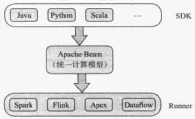
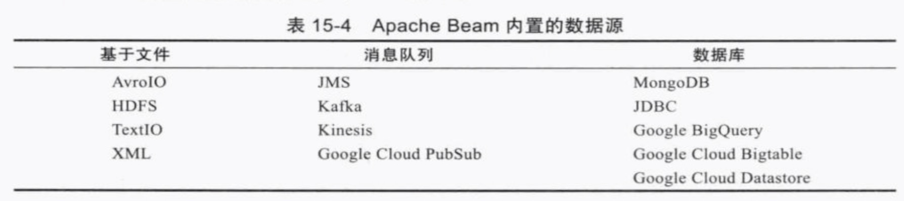
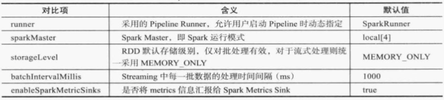

## 数据分析篇

### Hive

Spark SQL、Impala和Presto引擎可直接读取处理Hive Metastore中的数据表

#### 架构

- Driver
  - SQL解析、生成逻辑计划、物理计划、查询优化与执行
  - 输入为SQL语句
  - 输出为一系列分布式执行程序(可以为MapReduce、Tez或Spark)
- Metastore
  - 管理和存储元信息的服务
  - 保存数据库基本信息和数据表的定义等
  - 持久化到关系型数据库(默认嵌入式的Derby，可自定义为MySQL)
- Hadoop
  - 依赖Hadoop：HDFS、YARN、MapReduce


**可个性化指定每个HQL的执行引擎：MapReduce、Tez或Spark**




```sql
create table page_view (
	view_time String,
  country String,
  userId String,
  page_url String,
  referrer_url String,
  ip String
)
row format delimited fields terminated by ',' lines terminated by '\n'
stored as TEXTFILE

// 建表语法
create [temporary] [external] table [if not exists] [`db_name`].`table_name`
[(`col_name` `data_type` [comment `col_comment`],...)]
[partitioned by (`col_name` `data_type` [comment `col_comment`],...)]
[clustered by (`col_name`, `col_name`,...) into `num_buckets` buckets]
[
  [row format `row_fromat`]
  [stored as `file_format`]
]
[location `hdfs_path`]
[tblproperties (`property_name`=`property_vale`,...)]
[as `select_statement`]

// 解释
// 表类型
temporary table：临时表
	仅当前session可见，一旦session退出，该数据表将自动被删除
exteral table：外部表
	外部表的数据存储路径是用户定义的，而非hive默认存放位置，外部表被删除后，其数据不会被清除(仅删除元数据)
managed table：受管理表
	默认的数据表类型，数据受Hive管理，与元信息生命周期一致
	
// 数据类型 data_type
// 基本数据类型
tinyint、smallint、int、bigint、boolean、float、double、double precision、string、binary、timestamp、decimal、date、varchar和char
// 数组
array 类似Java数组
// 映射表
map 类似Java的map
// 结构体
struct 类似c语言中的结构体：由一系列具有相同类型或不同类型的数据构成的数据集合
// 联合体
union 类似c语言中的联合体：和结构体类似，但它将几种不同或相同类型的变量存放在同一段内存单元中

// 分区表和分桶表：为加速数据处理，将数据划分成更小的存储单位 partitioned by & clustered by
// 分区表
数据表可按照某个或几个字段进一步划分成多个数据分区，不同分区数据将被存放在不同目录中
// 分桶表 
数据表或数据分区可进步按照某个字段划分成若干桶

// 行格式 row format
// 仅对行式存储格式有意义

// 数据格式 file_format
textfile
sequencefile
rcfile
orc
parquet
avro
inputformat input_format_classname outputformat output_format_classname: 通过自定义这两个组件定义数据格式

// 数据存放位置 hdfs_path
每个表对应数据将被存放在一个单独的目录中
参数配置：hive.metastore.warehouse.dir指定，默认是 /usr/hive/warehouse/<database_name>.db/<table_name>/

// 表属性
hbase.table.name="table_name" // 用于hive与HBase集成，表示该hive表对应的HBase表为table_name
orc.compress="ZLIP"
```


#### 查询

- Order by 和 Sort by
  - Order by只启动一个reduceTask,Sort by 启动多个reduceTask

- Distribute by 和 Cluster by
  - distribute by 按指定字段或表达式对数据进行拆分
  - Cluster by等价于 Distribute by 和 Sort by的结合
  - SELECT col1, col2 FROM t1 CLUSTER BY col1 同比 SELECT col1,col2 FROM t1 DISTRIBUTE BY col1 SORT BY col1
  - 数据量大时，推荐使用 distribute by  + sort by 的方案


### Spark SQL

#### 架构


### 统一编程模型

#### Apache Beam

- SDK
  - Pipeline：封装整个数据处理逻辑计算：包括输入、处理以及输出；每个Beam必须创建一个Pipeline，并定义其运行相关配置选项(比如采用的计算引擎、计算引擎的相关参数等)
  - PCollection：分布式数据集的抽象；可以是有限的(bounded)，即来自固定数据源如HDFS；可以是无限的(unbounded)，即来自不断更新的数据源如Kafka消息队列
  - Transform：是Pipeline中一个数据处理操作或步骤，每个Transform以一个或多个PCollection对象作为输入，依次遍历其中每一个元素并作用在用户定义的函数上，最终产生一个或多个PCollection对象
  - IO Source与Sink：对数据读取和存储逻辑的抽象
- Runner



##### Beam IO




##### 构建Pipline

创建Pipline时需定义配置信息：封装在PipelineOptions中

- DirectPiplineOptions
- SparkPiplineOptions
- FlinkPiplineOptions
- ApexPiplineOptions


SparkPiplineOptions: 


##### 序列化、反序列器

Beam默认序列化框架为Coder

CoderRegister：Beam中序列化器注册中心，所有用到的序列化器统一在该类中注册；默认预先注册了多种基本类型的序列化器，还提供了Protobuf、Avro、 Writable等高级数据类型的序列化器


##### 流式计算

窗口 滚动、滑动、Session

延迟和乱序 Watermark 和 Trigger

```java
// 2分钟 滚动(固定)窗口； 
// 水位； 
// 过早到达的数据，不需要等待watermark时间戳触发计算，而是每1分钟便进行一次计算
// 延迟到达的数据，每收到1条数据就进行一次计算 
// 运行每个窗口的数据最多延迟一分钟到达
// 丢弃模式：discardingFiredPanes()
// 累计模式：accumulatingFiredPanes()
// 累计并撤销模式：accumulatingAndRetractingFiredPanes()
PCollection<KV<String, Integer> scores = input
	.apply(
  		Window.into(FixedWindows.of(Duration.standardMinutes(2)))
  		.triggering(
        		AtWatermark()
            .withEarlyFirings(AtPeriod(Duration.standardMinutes(1)))
        		.withLateFirings(AtCount(1)))
  		.discardingFiredPanes() // “丢弃”模式
  		.withAllowedLateness(Druation.standardMinutes(1)))
  .apply(Sum.integersPerKey());
```


