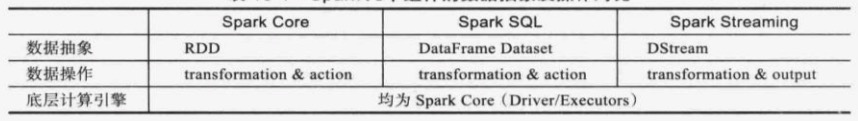

## 流式实时计算引擎

### 简介

面向行处理(row-based)：延迟低，吞吐率也低

面向微批处理(micro-batch)：延迟高，吞吐率高


### Storm

#### 概念：

- Tuple
  - 由一组可序列化的元素构成，每个元素可是任意类型(可序列化)
- Stream
  - 无限的Tuple形成的Stream，每个Stream由唯一ID，对Tuple中元素命名的Schema和无限的Tuple构成
- Topology
  - 用户应用程序 - 一系列Spout和Blot组成的DAG任务
  - 每个Topology中，每个Spout和Blot由多个Task构成，Task之间互相独立，可并行执行
- Spout
  - Stream的数据源：Spout可将数据发送到一个或多个Stream中
- Bolt
  - 消息处理逻辑：包括过滤、聚集、与外部数据库通信、转换等
  - 可进一步将数据发送到一个或多个Stream中
- Stream Grouping：决定Topology中Tuple在不同Task之间传递的方式
  - Shuffle Grouping：随机轮询方式，Task产生的Tuple将采用轮询的方式发送给下一类组件的Task
  - LoaclOrShuffle Grouping：经过优化的Shuffle Grouping，同一个Worker内的Task优先将Tuple传递给同Worker的替他Task
  - Fields Grouping：某个字段值相同的Tuple将被发送给同一个Task

#### 架构：


- Nimbus
  - 集群的管理和调度组件
  - 通常只有一个
  - 负责代码的分发，任务调度，故障监控及容错(重新将失败的任务调度到其他机器上)
  - 无状态(可直接kill -9)
- Supervisor
  - 计算组件，通常有多个，负责执行实际的计算任务
  - 根据Nimbus启动或停止Worker进程
  - 无状态
  - Worker：实际的计算进程，每个Supervisor启动多个Worker进程(需静态为每个Worker分配一个固定端口号)，每个Worker只属于特定的某个Topology
  - Executor：每个Worker内部可启动多个Executor线程，以运行实际用户逻辑代码(Task)；每个Executor可运行同类组件(同一个Topology内的Spout或Bolt) 中一个或多个Task
  - Task：用户逻辑代码
- Zookeeper：存储状态信息和运行时统计信息
  - Supervisor注册和发现，监控失败的Supervisor
  - Worker通过Zookeeper向Nimbus发送包含Executor运行状态的心跳信息
  - Supervisor通过Zookeeper向Nimbus发送包含自己最新状态的心跳信息


```java
Config conf = new Config();
conf.setNumWorkers(2);  // 设置Worker进程数

topologyBuilder.setSpout("kafka-spout", new KafkaSpout(), 2); // 为KafkaSpout启动2个Executor
topologyBuilder.setBolt("split-bolt", new SplitBolt(), 2) // 为SplitBolt启动2个Executor线程
								.setNumTasks(4) // 设置Task数量
  							.shuffleGrouping("kafka-spout");
topologyBuilder.setBolt("merge-bolt", new MergeBolt(), 6)
  							.shuffleGrouping("split-bolt");
StromSubmitter.submitTopology("mytopology", conf, topologyBuilder.createTopology());
```

一旦Topology运行起来，用户可通过WebUI或Shell命令动态修改Topology的并发度

```shell
# 将Worker数目增加到4，kafka-spout的Executor数目增加到4，merge-bolt的Executor数目增加到8
storm rebalance mytopology -n 4 -e kafka-spout=4 -e merge-bolt=8
```


#### Storm可靠性

Storm acker:

- 为每个Spout Tuple保存一个64位的校验值，初始值为0
- 每当Bolt发送或接受一个Tuple，该Tuple的ID(每个Tuple均对应一个唯一的64位ID)跟这个校验值进行异或操作
- 如果每个Tuple处理完成了。则校验值变为0，意味着Tuple被完成的处理完毕。

如果一条消息在一定时间内未处理完成，则Storm认为该消息丢失或者未处理完整，则由acker通知Spout重新发送数据 —— At least once 一致性语言


### Spark Streaming

微批处理：近实时

DStream：流式的RDD序列

- Transformation
  - DStream to DStream
- output
  - 产生一个或一组结果



```scala
// 上下文 StreamingContext
val conf = new SparkConf().setAppName("test").setMaster(master) // 应用名称、运行模式Master
val ssc = new StreamingContext(conf, Seconds(1))  // Seconds(1) 表示批处理间隔
```

- 创建StreamingContext
- 设置数据源，并创建DStream与数据源交互
- 实现核心计算逻辑：调用DStream上的Transformation和output
- 启动应用程序：StreamingContext.start()
- 等待应用结束运行：StreamingContext.awaitTermination() 退出或错误退出

#### 数据源

- 基础数据源
  - 文件系统API、Socket、actor
  - Streamcontext.fileStream[keyclass, valueclass, inputformatclass] (dataDirectory)
- 高级数据源
  - Kafka、Flume等，需引入外部依赖包

#### 可靠性

- checkpoint
  - 允许用户将数据和状态定期保存到文件系统中，一旦重启，可直接从文件系统中恢复
  - StreamingContext.checkpoint(checkpointDirectory) 启用状态恢复机制 (通常为HDFS上：可靠)
  - checkpoint会详尽记录程序的上下文，这使得应用程序很难升级
- Offset management
  - 将每次处理的RDD偏移量记录下来，一旦重启，重新从未处理完的位置开始处理数据
  - 开销小，兼容性好
  - 需要依赖可靠的数据来源：Kafka或HDFS

