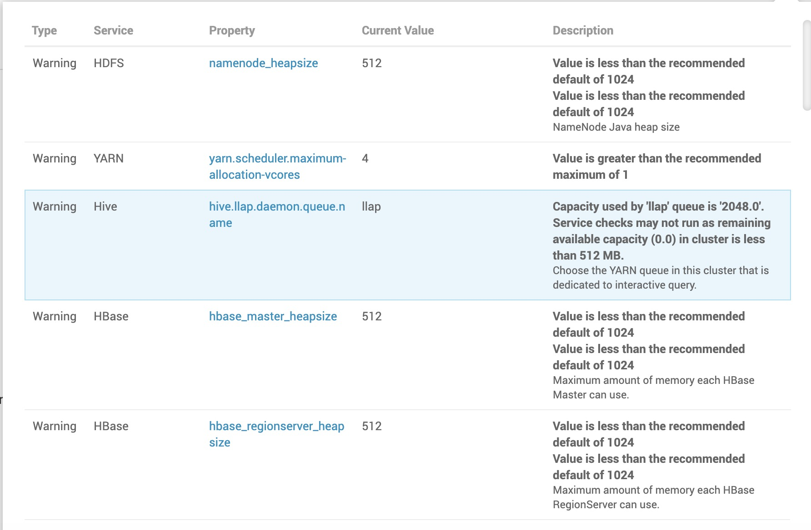

## 配置挖掘

### HDFS：

文件目录：

> - DataNode directories
>   - /hadoop/hdfs/data
> - NameNode directories
>   - /hadoop/hdfs/namenode
> - SecondaryNameNode Checkpoint directories
>   - /hadoop/hdfs/namesecondary
> - NFSGateway dump directory
>   - /tmp/.hdfs-nfs
> - NameNode Backup directory
>   - /tmp/upgrades
> - JournalNode Edits directory
>   - /hadoop/hdfs/journalnode
> - NameNode Checkpoint Edits directory
>   - ${dfs.namenode.checkpoint.dir}
> - Hadoop Log Dir Prefix
>   - /var/log/hadoop
> - Hadoop PID Dir Prefix
>   - /var/run/hadoop

配置：

> * NameNode Java heap size： NameNode堆栈大小
> * NameNode Server threads： NameNode线程数
> * Minimum replicated blocks %：  NameNode最小复制块％
> * DataNode failed disk tolerance：  DataNode磁盘容差失败
> * DataNode maximum Java heap size：  DataNode最大堆栈
> * DataNode max data transfer threads：DataNode最大数据传输线程
> * NameNode new generation size：  NameNode新生代大小 
> * NameNode maximum new generation size：  NameNode新生代最大值
> * NameNode permanent generation size：  NameNode持久代大小
> * NameNode maximum permanent generation size：  NameNode持久代最大值
> * Hadoop maximum Java heap size： Hadoop最大Java堆栈大小
> * HDFS Maximum Checkpoint Delay：HDFS最大检查点延迟
> * Reserved space for HDFS：HDFS的预留空间
> * Block replication：Block副本数，默认3
> * NFSGateway maximum Java heap size：NFSGateway最大Java堆大小
>
> core-site配置项
>
> 缓冲区大小；rpc端口；

### YARN:

文件目录：

> - YARN NodeManager Local directories
>   - /hadoop/yarn/local
> - YARN Timeline Service Entity Group FS Store Active directory
>   - /ats/active/
> - YARN Node Labels FS Store Root directory
>   - /system/yarn/node-labels
> - YARN NodeManager Recovery directory
>   - {{yarn_log_dir_prefix}}/nodemanager/recovery-state
> - YARN Timeline Service Entity Group FS Store Done directory
>   - /ats/done/
> - YARN NodeManager Log directories
>   - /hadoop/yarn/log
> - YARN NodeManager Remote App Log directory
>   - /app-logs
> - YARN Log Dir Prefix
>   - /var/log/hadoop-yarn
> - YARN PID Dir Prefix
>   - /var/run/hadoop-yarn

配置：

> * Memory allocated for all YARN containers on a node：为节点上的所有YARN容器分配的内存
> * Minimum Container Size (Memory)：容器最小内存
> * Maximum Container Size (Memory)：容器最大内存
> * Node Labels：true/false 节点标签 参考：基于节点标签的调度(Hadoop大数据.md)
> * Pre-emption：true/false 资源抢占模式
> * CPU Scheduling and Isolation：true/false CPU调度与隔离
> * Number of virtual cores：虚拟核心数量
> * Minimum/Maximum Container Size (VCores)：容器最小/最大虚拟核心数据
> * GPU Scheduling and Isolation：true/false GPU调度与隔离
> * Maximum Container Size (GPU)： 最大容器GPU大小
> * ResourceManager Java heap size：ResourceManager堆栈大小
> * yarn.acl.enable：true/false 访问控制
> * yarn.admin.acl：activity_analyzer,yarn 访问控制
> * NodeManager Java heap size：NodeManager堆栈大小
>
> Application Timeline Server: **TODO查询如何配置**
>
> - AppTimelineServer Java heap size
>
> Fault Tolerance：
>
> - yarn.resourcemanager.ha.enabled
> - yarn.nodemanager.recovery.enabled
> - yarn.resourcemanager.recovery.enabled
> - yarn.resourcemanager.zk-address
>
> Advanced yarn-hbase-env:
>
> - yarn_hbase_client_memory
> - yarn_hbase_master_memory
> - yarn_hbase_regionserver_memory

### MapReduce2:

文件目录：

> * Mapreduce JobHistory Done directory
>   * /mr-history/done
> * Mapreduce JobHistory Intermediate Done directory
>   * /mr-history/tmp
> * YARN App Mapreduce AM Staging directory
>   * /user
> * Mapreduce Log Dir Prefix
>   * /var/log/hadoop-mapreduce
> * Mapreduce PID Dir Prefix
>   * /var/run/hadoop-mapreduce
> * mapred.local.dir
>   * /hadoop/mapred

### Tez

> * tez.am.resource.memory.mb
> * tez.task.resource.memory.mb
> * tez.grouping.max-size
> * tez.grouping.min-size
> * tez.runtime.compress.codec: org.apache.hadoop.io.compress.SnappyCodec

### Hive：

文件目录：

> * Hive Metastore Warehouse directory
>   * /warehouse/tablespace/managed/hive
> * Hive Exec Scratchdir
>   * /tmp/hive
> * Hive User Install directory
>   * /user/
> * TEZ Lib URIs
>   * /hdp/apps/${hdp.version}/tez/tez.tar.gz
> * Hive Log Dir
>   * /var/log/hive
> * HiveServer2 Logging Operation Log Location
>   * /tmp/hive/operation_logs
> * Hive PID Dir
>   * /var/run/hive

配置：

> * Enable Interactive Query (requires YARN pre-emption) 
> * Interactive Query Queue: 默认 llap
> * Number of nodes used by Hive's LLAP

### HBase:

文件目录：

> * HBase Java IO Tmpdir
>   * /tmp
> * HBase Bulkload Staging directory
>   * /apps/hbase/staging
> * HBase Local directory
>   * ${hbase.tmp.dir}/local
> * HBase root directory
>   * /apps/hbase/data
> * HBase tmp directory
>   * /tmp/hbase-${user.name}
> * ZooKeeper Znode Parent
>   * /hbase-unsecure
> * HBase Log Dir Prefix
>   * /var/log/hbase
> * HBase PID Dir
>   * /var/run/hbase

配置：

> * HBase Master Maximum Memory
> * HBase RegionServer Maximum Memory
> * HBase Region Block Multiplier 
> * Number of Handlers per RegionServer
> * Maximum Client Retries
> * Maximum Record Size
> * Maximum Region File Size
> * Major Compaction Interval 主要压实间隔(合并)
> * Maximum Files for Compaction 最大压缩文件数
> * Enable Phoenix
> * Number of Phoenix Index Handlers per RegionServer

RowKey设计

> * Rowkey由用户自定义的一串不重复的字符串
> * Rowkey排序：按字典排序
> * 如果用到之前使用过的Rowkey，则会更新对应的Rowkey的数据，之前的数据不会删除，只是变成了低版本

Column Family设计

> * 官方建议列簇尽量少：可保证同一列簇数据尽量放在同一节点，提高性能

### Oozie:

文件目录

> * Oozie Data Dir
>   * /hadoop/oozie/data
> * Oozie Tmp Dir
>   * /var/tmp/oozie
> * Oozie Log Dir
>   * /var/log/oozie
> * Oozie PID Dir
>   * /var/run/oozie

### Zookeeper:

文件目录：

> * ZooKeeper directory
>   * /hadoop/zookeeper
> * ZooKeeper Log Dir
>   * /var/log/zookeeper
> * ZooKeeper PID Dir
>   * /var/run/zookeeper

### Spark2:

文件目录：

> * Livy2 Log directory
>   * /var/log/livy2
> * Spark Eventlog directory
>   * hdfs:///spark2-history/
> * Spark History FS Log directory
>   * hdfs:///spark2-history/
> * Spark Log directory
>   * /var/log/spark2
> * Livy2 PID directory
>   * /var/run/livy2
> * Spark PID directory
>   * /var/run/spark2
> * spark.history.store.path
>   * /var/lib/spark2/shs_db

配置：

> * spark.yarn.queue  : 指定spark的队列资源， 默认为default
> * spark.master： yarn
> * spark.shuffle.file.buffer
> * spark.shuffle.io.backLog
> * spark.shuffle.io.serverThreads
> * spark.shuffle.unsafe.file.output.buffer
> * spark.sql.autoBroadcastJoinThreshold
> * spark.sql.hive.convertMetastoreOrc
> * spark.sql.warehouse.dir  ： /apps/spark/warehouse

第二次安装提示信息：

### 注意点：

> * RegionServer 需安装在DataNode上，优化本地查询 