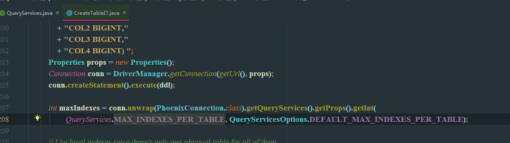

## HBase优化

列簇数量： 建议2个或2个一下

索引表数量：建议不超过10个

```
phoenix.index.maxIndexesPerTable=10
```



```
问：能够问一下，如果hbase 表rowkey 前缀做了散列，而查询的时候我只有后缀，这该怎么查询呢?
答：正则过滤器
```

```
HDFS 短路读
RowKey优化，添加时间信息
HBase cache
hfile文件数量是否太多了？compact减少
内存太小了吧，32g以上
```


## Phoenix优化

jdbc:phoenix:thin:url=http://localhost:8765?doAs=alice

问题：

   1. 字段映射

   2. 索引 异步 ASYNC
      Example: create index if not exists event_object_id_idx_b on trans.event (object_id) ASYNC UPDATE_CACHE_FREQUENCY=60000;
      Create local indexes for write-heavy use cases.
         索引表和主表放在同一RegionServer上
         当查询字段不是索引字段时，索引表也会正常使用
      Create global indexes for read-heavy use cases.
         To save read-time overhead, consider creating covered indexes. 节省时间开销
         索引表为全局表，各个节点上都有
         当查询字段不是索引字段时，索引表将失效，导致全局扫描主表
      

Use covered indexes to convert table scans into efficient point lookups or range queries over the index table instead of the primary table: CREATE INDEX index ON table( … )INCLUDE( … )
      


   3. 数据压缩

   4. 对象序列化

   5. 删除

      ​	When deleting a large data set, turn on autoCommit before issuing the DELETE query

   6. 主键

      ​	If the primary key is monotonically increasing, create salt buckets：加盐可防止数据写入热点问题


   映射：HBase中的表
      如果需要在phoenix中操作直接在hbase中创建的表，则需要在phoenix中进行表的映射。映射方式有两种：视图映射和表映射。


#### 性能测试：

https://www.cnblogs.com/ballwql/p/8371234.html

