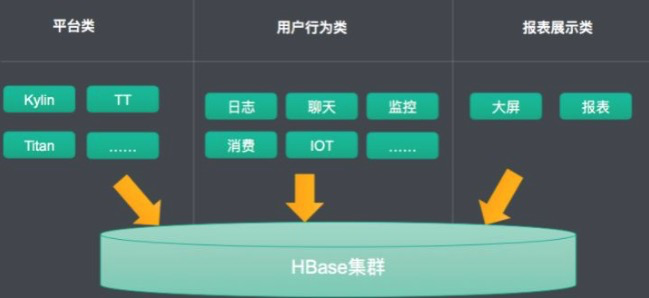
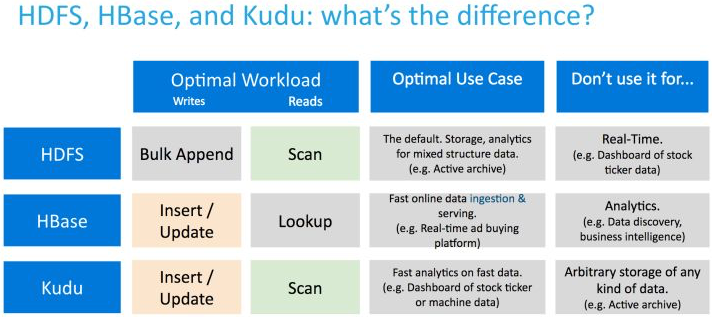

## HBase使用场景

特点：

- 强一致性读写
- 自动分片

因为HDFS在小于5个数据节点时，基本上体现不出来它的优势

HBase作为默认的大数据时代的存储，基本解决以下三大类的场景：

1、平台类：存放是平台的产品，就是其它软件的存储，比如目前很就行的Kylin，阿里内部的日志同步工具TT，图组件Titan等。此类存放的往往平台的数据，有时候往往是无业务含义的。作为平台的底层存储使用。 
2、用户行为类：此类主要是面向各个业务系统。这里的用户不仅仅指的人，也包括物，比如物联网。在阿里主要还是人产生的数据，比如：淘宝收藏夹、交易数据、旺旺聊天记录等等。这里使用比较直接，就直接存放HBase，再读取。难度就是需要支持千万级别的并发写访问及读取，需要解决服务质量的问题。 
3：报表类的需求：比如报表、大屏等，如阿里巴巴的天猫双十一大屏。

HBase与Kudu对比：

- Facebook
  -  Facebook用HBase存储在线消息，每天数据量近百亿，每月数据量250 ~ 300T， HBase读写比基本在1:1，吞吐量150w qps
- 小米
  - 10+在线HBase集群，好几百台服务器，米聊历史数据，消息push系统等多个重要应用系统都建立在HBase基础之上
- 网易
  - 哨兵监控系统，云信历史数据，日志归档数据等一系列重要应用底层都由HBase提供服务。

##### 适用场景

1. 写密集型应用，每天写入量巨大，而相对读数量较小的应用，比如IM的历史消息，游戏的日志等等

2. 不需要复杂查询条件来查询数据的应用，HBase只支持基于rowkey的查询，对于HBase来说，单条记录或者小范围的查询是可以接受的，大范围的查询由于分布式的原因，可能在性能上有点影响，而对于像SQL的join等查询，HBase无法支持。

3. 对性能和可靠性要求非常高的应用，由于HBase本身没有单点故障，可用性非常高。

 数据量较大，而且增长量无法预估的应用，HBase支持在线扩展，即使在一段时间内数据量呈井喷式增长，也可以通过HBase横向扩展来满足功能。