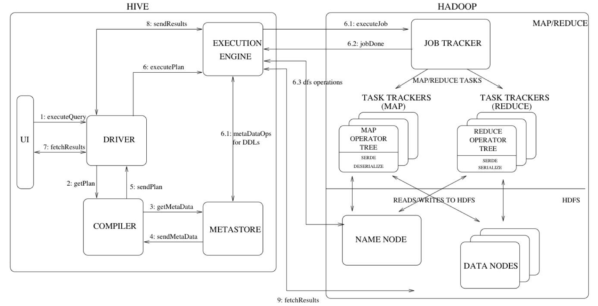
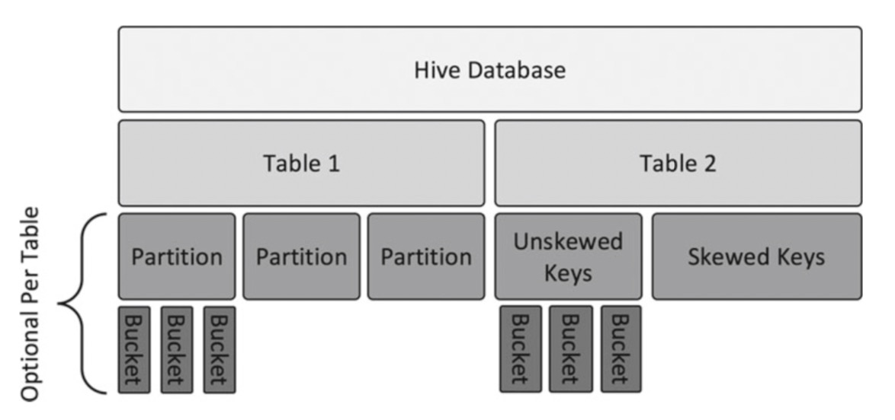

# Getting Started




### 数据类型

#### 基本数据类型

##### Numeric Types

> - TINYINT (1-byte signed integer, from -128 to 127)
> - SMALLINT (2-byte signed integer, from -32,768 to 32,767)
> - INT/INTEGER (4-byte signed integer, from -2,147,483,648 to 2,147,483,647)
>   - `INTEGER` is introduced as a synonym for `INT` in Hive 2.2.0 ([HIVE-14950](https://issues.apache.org/jira/browse/HIVE-14950)).
> - BIGINT (8-byte signed integer, from -9,223,372,036,854,775,808 to 9,223,372,036,854,775,807)
> - FLOAT (4-byte single precision floating point number)
> - DOUBLE (8-byte double precision floating point number)
> - DOUBLE PRECISION (alias for DOUBLE, only available starting with Hive 2.2.0)
> - DECIMAL
>   - Introduced in Hive 0.11.0 with a precision of 38 digits	
>   - Hive 0.13.0 introduced user-definable precision and scale
>   -  based on Java's BigDecimal
> - NUMERIC (same as DECIMAL, starting with Hive 3.0.0)

##### Date/Time Types

> - TIMESTAMP (Note: Only available starting with Hive 0.8.0)
>   - from_utc_timestamp
>   - to_utc_timestamp
>   -  SerDe property "timestamp.formats" 例子：yyyy-MM-dd'T'HH:mm:ss
> - DATE (Note: Only available starting with Hive 0.12.0)
>   - in the form `YYYY-­MM-­DD`
> - INTERVAL (Note: Only available starting with Hive 1.2.0)

##### String Types

> - STRING
> - VARCHAR (Note: Only available starting with Hive 0.12.0)
>   - between 1 and 65535
> - CHAR (Note: Only available starting with Hive 0.13.0)
>   - The maximum length is fixed at 255.

##### Misc Types

> - BOOLEAN
> - BINARY (Note: Only available starting with Hive 0.8.0)


#### 复杂数据类型

> - arrays: ARRAY<data_type> (Note: negative values and non-constant expressions are allowed as of Hive 0.14.)
> - maps: MAP<primitive_type, data_type> (Note: negative values and non-constant expressions are allowed as of Hive 0.14.)
> - structs: STRUCT<col_name : data_type [COMMENT col_comment], ...>
> - union: UNIONTYPE<data_type, data_type, ...> (Note: Only available starting with Hive 0.7.0.)
>   - 不完备，不建议使用
>   -  Queries that reference UNIONTYPE fields in JOIN ([HIVE-2508](https://issues.apache.org/jira/browse/HIVE-2508)), WHERE, and GROUP BY clauses will fail
>   - 如果你不care这个字段，使用这种类型


##### 强制指定Int类型

默认情况下，整型文字被假定为int，除非数字超过int的范围，在这种情况下，它被解释为bigint，或者如果数字上存在以下某个后缀。

| Type     | Postfix | Example |
| -------- | ------- | ------- |
| TINYINT  | Y       | 100Y    |
| SMALLINT | S       | 100S    |
| BIGINT   | L       | 100L    |


### DDL 

##### 建库

> CREATE (DATABASE|SCHEMA) [IF NOT EXISTS] database_name
>
> [COMMENT database_comment]
>
> [LOCATION hdfs_path]
>
> [WITH DBPROPERTIES(property_name=property_value,...)]

##### D删库

> DROP DATABASE database_name [RESTRICT|CASCADE]
>
> - RESTRICT 默认；如果库中存在表，则删除失败
> - CASCADE 可选；删除库时同时删除所有内部表和外部表

> SHOW (DATABASES|SCHEMA)[LIKE 'identifier_with_wildcards']
>
> 

##### 建表(外部表)

> CREATE EXTERNAL TABLE database_name.table_name (
>
> ​		name STRING,
>
> ​		age INT
>
> ​		ct TIMESTAMP
>
> )
>
> LOCATION '/user/demo/table_name'
>
> TBLPROPERTIES("skip.header.line.count"="2")
>
> PATTITIONED BY (city STRING);
>
> CLUSTERED BY (age) INTO 11 BUCKETS
>
> 
>
> - 不指定位置，将在Hive默认的目录下存放该表信息
> - TBLPROPERTIES 用于指定表的属性
>   - Hive中的一些重要表层级的属性
>     - last_modified_user
>     - last_modified_time
>     - immutable  不变的表，为true时，将无法再插入数据
>     - orc.compress
>     - skip.header.line.count  跳过文件的标题行
>   - 可自定义一些属性，存储一些额外信息
> - PATTITIONED BY 
>   - 指定分区字段  不需要包含在建表声明里
> - CLUSTERED BY
>   - 按age进行分桶 分为11个桶
>   - hive.enforce.bucketing=TRUE

> SHOW TABLES [IN database_name] [identifier_with_wildcards];	// 该语句列出当前数据库中所有的表和视图，可添加正则过滤
>
> DESCRIBE FORMATTED table_name; // show 表定义信息
>
> DESCRIBE EXTENDED table_name;  // 如果使用了extended关键字，则以Thrift序列化形式显示表的元数据，如果使用formatted关键字，则以表格形式显示元数据
>
> SHOW CREATE TABLE table_name; // 展示表的创建语句
>
> DROP  TABLE table_name;
>
> SHOW PARTITIONS table_name  [PARTITION(partition_desc)]
>
> SHOW [FORMATTED] (INDEX|INDEXES) ON table_with_index [(FROM|IN) db_name]
>
> - show index on table_name;
> - show formatted index on table_name;
>
> SHOW COLUMNS(FROM|IN) table_name [(FROM|IN) db_name]
>
> SHOW COMPACTIONS:该语句显示当Hive事务被使用时，所有正在被压缩或者预定压缩的表和分区 参见参考

##### 内部表

> - 一般不用
> - 使用场景
>   - 数据是临时存储的
>   - 访问数据的唯一方式是Hive，需要用Hive来完全管理表和数据的生命周期

##### 修改表的存储属性

> - 可以使用ALTER TABLE 修改，但推荐
>   - 拉取上一版本的建表语句，然后修改建表语句的存储属性，然后重新创建表
>   - modify the CREATE TABLE with new storage attributes, and recreate it

##### 合并表文件

> ALTERE TABLE table_name CONCATENATE;
>
> 该命令可将多个数据文件合并成大较大文件，但速度慢
>
> 最佳的方式是在数据进去Hadoop前就合并成集群数据块数倍大小的文件，通常为几GB或更大


视图View，只有逻辑视图，无物理视图

### DML


### High

hive 不支持删除更新

orc文件、parquet文件

Hive索引

"\n"需要清洗掉，不然hive会默认识别为另一个字段

##### 内部表、外部表

> 区别在于是否删除真实的表数据 on hdfs
>
> 多用外部表

##### 分区和分桶

> - 分区
>   - 优化查询
>   - 分区键：数据按分区键被分割成若干个逻辑块，并存放在单独的路径中
>   - 一般以时间为分区规则：例如每天生成一个路径
>   - 不要过度分区：会增加数据加载和数据检索的开销
>   - 问题：如何安装时间天进行分区？
>   - 规则
>     - 分区键的唯一值应该在较低到中间值之间？？？
>     - 避免分区小于1G  (越大越好)
>     - 当分区较多时，调整HiveServer2和Hive Metastore的内存
>     - 可以修改一个已分区表的Schema，但是一旦结构发生改变，你就无法在已有分区中修改数据了？？？ TODO check
> - 分桶
>   - 优化Join
>   - 分桶键：给分桶键定义最大分桶数目，数据基于Hash散列算法进行分割，每个桶内存储的是全字段的数据
>   - 非倾斜的键，数据将均匀分布，可实现高效的数据抽样
>   - 规则
>     - 选择唯一值多的键为桶键
>     - 桶个数设置为质数(定义为在大于1的自然数中，除了1和它本身以外不再有其他因数)
>       - 2	3	5	7	11	13	17	19	23	29	31	37	41	43
>     - 桶键的数据是倾斜时：为倾斜的值单独创建桶，借助列表分桶(list bucketing)可实现 ???
>     - **需要连接的表，其桶的数目必须相同**，或者一个表的桶数是另一个表的桶数的因子
>       - 假如整数n除以m，结果是无余数的整数，那么我们称*m*就是*n*的因子
>       - 质数没有其他因子,只有自己或1
>     - 设置桶数，要考虑整个集群的CPU，每个CPU只会对一个桶进行写入操作，大集群可设置大桶数以充分利用资源
>     - **表创建好之后，桶的个数不能改变** ？？？ TODO check new version
>     - 桶的大小至少1G，不然没必要分桶
>     - 设置 hive.enforce.bucketing=TRUE 强制分桶



SerDe

数据倾斜

Hive Streaming 


##### 排序

- Order by 和 Sort by
  - Order by只启动一个reduceTask,Sort by 启动多个reduceTask
- Distribute by 和 Cluster by
  - distribute by 按指定字段或表达式对数据进行拆分
  - Cluster by等价于 Distribute by 和 Sort by的结合
  - SELECT col1, col2 FROM t1 CLUSTER BY col1 同比 SELECT col1,col2 FROM t1 DISTRIBUTE BY col1 SORT B Y col1
  - 数据量大时，推荐使用 distribute by  + sort by 的方案


##### 如何确认一个Parquet文件是否被压缩

https://mp.weixin.qq.com/s/bjv6VccWdW5GLcdmR1tcyg


##### 内嵌查询统计

https://blog.csdn.net/gamer_gyt/article/details/52169441

##### Array:

```sql
# 数据
0001,爱丽丝,尼克/亚当,尼克,剧情/奇幻/爱情,马丁/艾德琳,2009,12,120,5000,8.9

# 建表
create table movie_message(
    id int,
	title string,
	daoyan array<string>,
	bianju array<string>,
	leixing array<string>,
	zhuyan array<string>,
	year int,
	month int,
	shichang int,
	disnum int,
	score float
)
comment "this table about movie's message"
row format delimited fields terminated by ","
collection items terminated by '/';    // 重要

# 方案：
# 	使用explode和lateral view关键字

# 查询
select lx,count(*) from movie_message lateral view explode(leixing) leixing as lx group by lx;

# 存储查询
insert overwrite local directory "/home/master/mycode/movie_leixing"
row format delimited fields terminated by "\t"
select lx,count(*) from movie_message lateral view explode(leixing) leixing as lx group by lx;
```

##### Map

```sql
# 数据  假设我们有这样格式的数据人物A，主演了BCD电影，将于2016-05上映
A       ABC:2016-05,EFG:2016-09
B       OPQ:2015-06,XYZ:2016-04

# 建表
create table people_movie(
 name string,
 movie map<string,string> )
 row format delimited fields terminated by "\t"
 collection items terminated by ","
 map keys terminated by ":";  // 重要

# 查询1
select explode(movie) as (m_name,m_time) from people_movie;
# 查询2
select name,mo,time from people_movie lateral view explode(movie) movie as mo,time;
```

##### Structs

```
# 数据 假设我们的数据格式是这样的，电影ABC，有1254人评价过，打分为7.4分
ABC     1254:7.4
DEF     256:4.9
XYZ     456:5.4

# 建表
create table movie_score(
    name string,
    info struct<number:int,score:float>
 )row format delimited fields terminated by "\t"
 collection items terminated by ":";
 
 # 查询
 select * from movie_score;
 select info.number,info.score from movie_score;
```

##### collect_set函数

```
# 数据  假设
select * from test;
OK
1       A
1       C
1       B
2       B
2       C
2       D
3       B
3       C
3       D

# 统计   现在要统计每个id得到的等级
select id,collect_set(name) from test group by id;

# 结果
OK
1       ["A","C","B"]
2       ["B","C","D"]
3       ["B","C","D"]
```


### 参考：

[博客：基本操作，性能优化](https://yq.aliyun.com/articles/33700)

[基本操作](https://zhuanlan.zhihu.com/p/36744886)

交互式处理：运行时间在两秒左右的处理

[DDL&DML](https://blog.csdn.net/skywalker_only/article/details/32709777)

[测试性能](https://my.oschina.net/u/3115904/blog/839486)

[hive2.0](https://blog.csdn.net/lvguichen88/article/details/70225719)

