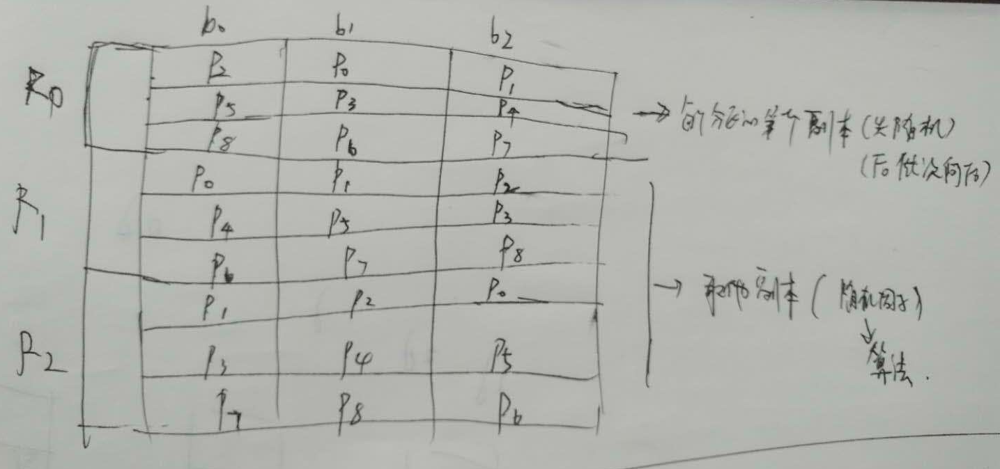

## Kafka分区算法

具体算法实现函数：

  类：AdminUtils：

  方法： assignReplicasToBrokers(...)


```scala
def assignReplicasToBrokers(brokerMetadatas: Seq[BrokerMetadata],
                            nPartitions: Int,
                            replicationFactor: Int,
                            fixedStartIndex: Int = -1,
                            startPartitionId: Int = -1): Map[Int, Seq[Int]] = {
  if (nPartitions <= 0)
    throw new InvalidPartitionsException("Number of partitions must be larger than 0.")
  if (replicationFactor <= 0)
    throw new InvalidReplicationFactorException("Replication factor must be larger than 0.")
  if (replicationFactor > brokerMetadatas.size) // 副本因子不能大于Broker个数
    throw new InvalidReplicationFactorException(s"Replication factor: $replicationFactor larger than available brokers: ${brokerMetadatas.size}.")
  if (brokerMetadatas.forall(_.rack.isEmpty))
    assignReplicasToBrokersRackUnaware(nPartitions, replicationFactor, brokerMetadatas.map(_.id), fixedStartIndex,
      startPartitionId)  // 无机柜处理逻辑
  else {
    if (brokerMetadatas.exists(_.rack.isEmpty))
      throw new AdminOperationException("Not all brokers have rack information for replica rack aware assignment.")
    assignReplicasToBrokersRackAware(nPartitions, replicationFactor, brokerMetadatas, fixedStartIndex,
      startPartitionId)  // 有机柜处理逻辑
  }
}

private def assignReplicasToBrokersRackUnaware(nPartitions: Int,
                                               replicationFactor: Int,
                                               brokerList: Seq[Int],
                                               fixedStartIndex: Int,
                                               startPartitionId: Int): Map[Int, Seq[Int]] = {
  val ret = mutable.Map[Int, Seq[Int]]()
  val brokerArray = brokerList.toArray
  val startIndex = if (fixedStartIndex >= 0) fixedStartIndex else rand.nextInt(brokerArray.length) // 第一个分区（编号为0）的第一个副本放置位置是随机从 brokerList 选择的
  var currentPartitionId = math.max(0, startPartitionId)
  var nextReplicaShift = if (fixedStartIndex >= 0) fixedStartIndex else rand.nextInt(brokerArray.length) // 剩余的副本相对于第一个副本放置位置其实是由 nextReplicaShift 决定的，而这个数也是随机产生的
  for (_ <- 0 until nPartitions) {
    if (currentPartitionId > 0 && (currentPartitionId % brokerArray.length == 0))
      nextReplicaShift += 1
    // 每个分区 第一副本真正的生成地方
    val firstReplicaIndex = (currentPartitionId + startIndex) % brokerArray.length // 其他分区的第一个副本放置位置相对于第0个分区依次往后移
    val replicaBuffer = mutable.ArrayBuffer(brokerArray(firstReplicaIndex))
    for (j <- 0 until replicationFactor - 1)
      replicaBuffer += brokerArray(replicaIndex(firstReplicaIndex, nextReplicaShift, j, brokerArray.length)) // 剩余的副本真正处理的地方
    ret.put(currentPartitionId, replicaBuffer)
    currentPartitionId += 1
  }
  ret
}

private def replicaIndex(firstReplicaIndex: Int, secondReplicaShift: Int, replicaIndex: Int, nBrokers: Int): Int = {
  val shift = 1 + (secondReplicaShift + replicaIndex) % (nBrokers - 1)
  (firstReplicaIndex + shift) % nBrokers
}

private def assignReplicasToBrokersRackAware(nPartitions: Int,
                                             replicationFactor: Int,
                                             brokerMetadatas: Seq[BrokerMetadata],
                                             fixedStartIndex: Int,
                                             startPartitionId: Int): Map[Int, Seq[Int]] = {
  val brokerRackMap = brokerMetadatas.collect { case BrokerMetadata(id, Some(rack)) =>
    id -> rack
  }.toMap
  val numRacks = brokerRackMap.values.toSet.size
  val arrangedBrokerList = getRackAlternatedBrokerList(brokerRackMap)
  val numBrokers = arrangedBrokerList.size
  val ret = mutable.Map[Int, Seq[Int]]()
  val startIndex = if (fixedStartIndex >= 0) fixedStartIndex else rand.nextInt(arrangedBrokerList.size)
  var currentPartitionId = math.max(0, startPartitionId)
  var nextReplicaShift = if (fixedStartIndex >= 0) fixedStartIndex else rand.nextInt(arrangedBrokerList.size)
  for (_ <- 0 until nPartitions) {
    if (currentPartitionId > 0 && (currentPartitionId % arrangedBrokerList.size == 0))
      nextReplicaShift += 1
    val firstReplicaIndex = (currentPartitionId + startIndex) % arrangedBrokerList.size
    val leader = arrangedBrokerList(firstReplicaIndex)
    val replicaBuffer = mutable.ArrayBuffer(leader)
    val racksWithReplicas = mutable.Set(brokerRackMap(leader))
    val brokersWithReplicas = mutable.Set(leader)
    var k = 0
    for (_ <- 0 until replicationFactor - 1) {
      var done = false
      while (!done) {
        val broker = arrangedBrokerList(replicaIndex(firstReplicaIndex, nextReplicaShift * numRacks, k, arrangedBrokerList.size))
        val rack = brokerRackMap(broker)
        // Skip this broker if
        // 1. there is already a broker in the same rack that has assigned a replica AND there is one or more racks
        //    that do not have any replica, or
        // 2. the broker has already assigned a replica AND there is one or more brokers that do not have replica assigned
        if ((!racksWithReplicas.contains(rack) || racksWithReplicas.size == numRacks)
            && (!brokersWithReplicas.contains(broker) || brokersWithReplicas.size == numBrokers)) {
          replicaBuffer += broker
          racksWithReplicas += rack
          brokersWithReplicas += broker
          done = true
        }
        k += 1
      }
    }
    ret.put(currentPartitionId, replicaBuffer)
    currentPartitionId += 1
  }
  ret
}
```


- 副本因子不能大于Broker个数
- 第一个分区（编号为0）的第一个副本放置位置是随机从 brokerList 选择的
- 其他分区的第一个副本放置位置相对于第0个分区依次往后移
- 剩余的副本相对于第一个副本放置位置其实是由 nextReplicaShift 决定的，而这个数也是随机产生的


运行效果：

```
assignReplicasToBrokers(Seq(0, 1, 2, 3), 3, 3)   // 机器信息、分区数、副本数
(0,List(3, 2, 0))
(1,List(0, 3, 1))
(2,List(1, 0, 2))
 
assignReplicasToBrokers(Seq(0, 1, 2, 3), 5, 3)
(0,List(3, 1, 2))
(1,List(0, 2, 3))
(2,List(1, 3, 0))
(3,List(2, 0, 1))
(4,List(3, 2, 0))
 
assignReplicasToBrokers(Seq(0, 1, 2, 3), 9, 3)
(0,List(1, 0, 2))
(1,List(2, 1, 3))
(2,List(3, 2, 0))
(3,List(0, 3, 1))
(4,List(1, 2, 3))
(5,List(2, 3, 0))
(6,List(3, 0, 1))
(7,List(0, 1, 2))
(8,List(1, 3, 0))
```


To achieve this goal for replica assignment without considering racks, we: （无机柜情况下的分区规则）

- 1. Assign the first replica of each partition by round-robin, starting from a random position in the broker list. （第一个 replica 随机）
- 2. Assign the remaining replicas of each partition with an increasing shift.（后续 replicas 在第一个位置渐增移位）

- Here is an example of assigning
- broker-0 broker-1 broker-2 broker-3 broker-4
- p0    p1    p2    p3    p4    (1st replica)
- p5    p6    p7    p8    p9    (1st replica)
- p4    p0    p1    p2    p3    (2nd replica)
- p8    p9    p5    p6    p7    (2nd replica)
- p3    p4    p0    p1    p2    (3nd replica)
- p7    p8    p9    p5    p6    (3nd replica)





Java实现：

```java
private static final Random RANDOM = new Random();

private Map<Integer, List<Integer>> assignReplicasToBrokersRackUnaware(int nPartitions, int replicationFactor, Integer[] brokerList, int fixedStartIndex, int startPartitionId) {

    Map<Integer, List<Integer>> rs = Maps.newHashMap();

    List<Integer> brokerArray = Arrays.asList(brokerList);
    int startIndex;

    if (fixedStartIndex >= 0) {
        startIndex = fixedStartIndex;
    } else {
        startIndex = RANDOM.nextInt(brokerArray.size());
    }
    int currentPartitionId = Math.max(0, startPartitionId);
    int nextReplicaShift;
    if (fixedStartIndex >= 0) {
        nextReplicaShift = fixedStartIndex;
    } else {
        nextReplicaShift = RANDOM.nextInt(brokerArray.size());
    }

    for (int i = 0; i < nPartitions; i++) {
        if (currentPartitionId > 0 && (currentPartitionId % brokerArray.size() == 0))
            nextReplicaShift += 1;
        int firstReplicaIndex = (currentPartitionId + startIndex) % brokerArray.size();

        List<Integer> replicaBuffer = new ArrayList<>();
        replicaBuffer.add(brokerArray.get(firstReplicaIndex));

        for (int j = 0; j < replicationFactor - 1; j++) {
            replicaBuffer.add(brokerArray.get(replicaIndex(firstReplicaIndex, nextReplicaShift, j, brokerArray.size())));
        }
        rs.put(currentPartitionId, replicaBuffer);
        currentPartitionId += 1;
    }
    return rs;
}

private int replicaIndex(int firstReplicaIndex, int secondReplicaShift, int replicaIndex, int nBrokers) {
    int shift = 1 + (secondReplicaShift + replicaIndex) % (nBrokers - 1); // 计算偏移  | 计算方式非常巧妙，它保证了shift的取值范围：[1，nBrokers-1]
    System.out.println("----: shift：" + shift);
    return (firstReplicaIndex + shift) % nBrokers;
}

public static void main(String[] args) {
    kafkaBrokerTest kafkaBrokerTest = new kafkaBrokerTest();

    Map<Integer, List<Integer>> integerListMap = kafkaBrokerTest.assignReplicasToBrokersRackUnaware(9, 3, new Integer[]{0, 1, 2, 3}, -1, -1);

    integerListMap.forEach((a,b) -> {
        System.out.println("P" + a + " -> " + b);
    });
}
```

