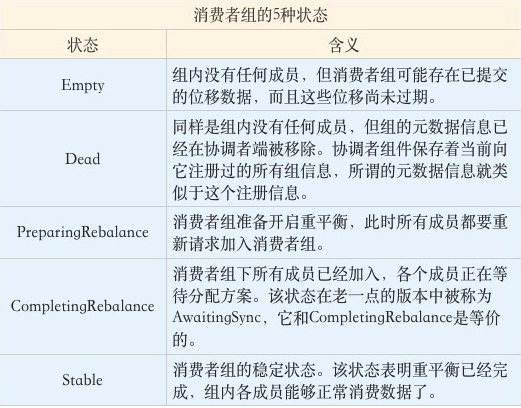

## Kafka调优

- 基于Key来生产消息的业务，不可动态调整分区数量，这将打破其原有hash算法的结果，导致消息顺序无法保证（当然业务场景可以的话，是没关系的）

- 同一Partition，如果存在未ACK的offset，在消费者未重启的情况下，消费者不会自动重新消费未提交ACK的offset；

  如果消费者重启了，那么会从未ACK的offset处继续往后执行，但是这里一个问题，如果在该Partition上后续有一个高于这个未ACK的offset的偏移量成功ACK，

  那么该Partition之前未ACK的所有记录都会丢失，已这次成功ACK的offset为最新偏移量，意味着未ACK的部分数据丢失

##### 估算Kafka分区数

一般根据未来1到2年的目标吞吐量来设计kafka的分区数量

- 基于生产消费的吞吐量进行估算
  - 假设对于单个partition，producer端的可达吞吐量为p，Consumer端的可达吞吐量为c，期望的目标吞吐量为t，那么集群所需要的partition数量至少为max(t/p,t/c)
  - 在producer端，单个分区的吞吐量大小会受到批量大小、数据压缩方法、 确认类型（同步/异步）、复制因子等配置参数的影响

业务初期，可以多配置分区数，少部署Broker数量，这样后续业务增长，我们只需添加Broker数量，然后以**在线方式**将适当比例的partition转移到新增加的broker中去

**越多的分区需要打开更多地文件句柄**

- 每个分区都会对照着文件系统的一个目录
- 每个日志数据段都会分配两个文件，一个索引文件和一个数据文件
- 机器的文件句柄可配置依据机器性能，**配置十万、百万级别**（ulimit -n）
- 文件系统类型：官网的测试报告，XFS的性能要强于ext4
- swap的调优：禁用或者设置很小的值（能够观测到Broker性能开始出现急剧下降）

##### 规划磁盘容量

- 新增消息数  ： 每天1亿
- 消息留存时间 ： 14天
- 平均消息大小  ： 1KB
- 备份数 ： 共2份数据
- 是否启用压缩 ：假设压缩比是0.75

1亿 * 1KB * 2 / 1000 / 1000 = 200GB

索引存储等其他数据存储，故再为这些数据预留出10%的磁盘空间，所以总容量为220GB

保存两周：220GB * 14，大约3TB左右

压缩后：0.75 * 3 = 2.25TB。

##### 带宽（评估机器数量）

- 1Gbps的千兆网络
- 10Gbps的万兆网络
- 目标：在1小时内处理1TB的业务数据， 需要多少台Kafka服务器来完成（假设带宽是1Gbps， 即每秒处理1Gb的数据，注意是小b）
  - kafka独占一台机器
  - 最大带宽：单个kafka只能占用机器的70%带宽资源（超过70%的阈值就有网络丢包的可能性）：单台Kafka服务器最多也就能使用大约700Mb的带宽资源
  - 保留带宽：（不能让Kafka服务器常规性使用这么多资源）
    - 额外预留出2/3（保守值）的资源，单台服务器使用带宽700Mb / 3 ≈ 240Mbps
  - 1小时内处理1TB：1024 * 1024 * 8 Mb / (60 * 60) s ≈ 2336Mbps
  - 2336Mbps /  240Mbps ≈ 10台

##### Rebalance触发条件

- 组成员数量发生变化

  - session.timeout.ms

  - heartbeat.interval.ms

  - max.poll.interval.ms

  - GC参数

  - 当Consumer Group完成Rebalance之后，每个Consumer实例都会定期地向Coordinator发送心跳请求，表明它还存活着。如果某个Consumer实例不能及时地发送这些心跳请求，Coordinator就会认为该Consumer已经“死”了，从而将其从Group中移除，然后开启新一轮Rebalance。Consumer端有个参数，叫session.timeout.ms，就是被用来表征此事的。该参数的默认值是10秒，即如果Coordinator在10秒之内没有收到Group下某Consumer实例的心跳，它就会认为这个Consumer实例已经挂了。可以这么说，session.timout.ms决定了Consumer存活性的时间间隔。

    除了这个参数，Consumer还提供了一个允许你控制发送心跳请求频率的参数，就是heartbeat.interval.ms。这个值设置得越小，Consumer实例发送心跳请求的频率就越高。频繁地发送心跳请求会额外消耗带宽资源，但好处是能够更加快速地知晓当前是否开启Rebalance，因为，目前Coordinator通知各个Consumer实例开启Rebalance的方法，就是将REBALANCE_NEEDED标志封装进心跳请求的响应体中。

    除了以上两个参数，Consumer端还有一个参数，用于控制Consumer实际消费能力对Rebalance的影响，即max.poll.interval.ms参数。它限定了Consumer端应用程序两次调用poll方法的最大时间间隔。它的默认值是5分钟，表示你的Consumer程序如果在5分钟之内无法消费完poll方法返回的消息，那么Consumer会主动发起“离开组”的请求，Coordinator也会开启新一轮Rebalance。

- 订阅主题数量发生变化

- 订阅主题的分区数发生变化

##### auto.offset.reset

当consumer启动后它会从Kafka读取它上次消费的位移。

- 情况1： 如果 Kafka broker端没有保存这个位移值，那么consumer会看auto.offset.reset的脸色

- 情况2：consumer拿到位移值开始消费，如果后面发现它要读取消息的位移在Kafka中不存在（可能对应的消息已经被删除了），那么它也会看auto.offset.reset的脸色

- 情况3：除以上这两种情况之外consumer不会再顾忌auto.offset.reset的值

怎么看auto.offset.reset的脸色呢？简单说就是earliest从头消息；latest从当前新位移处消费。

##### 位移提交

位移提交的语义保障是由你来负责的，Kafka只会“无脑”地接受你提交的位移

从用户的角度来说，位移提交分为自动提交和手动提交；从Consumer端的角度来说，位移提交分为同步提交和异步提交

使用KafkaConsumer.seek可以精确控制你要开始消费的位移

standalone consumer没有rebalance，也没有group提供的负载均衡，你需要自己实现。其他方面（比如位移提交）和group没有太大的不同

##### 预防CommitFailedException

- 缩短单条消息处理时间 - 优化业务代码
- 增加Consumer端允许下游系统消费一批消息的最大时长（max.poll.interval.ms：默认值是5分钟）
- 减少下游系统一次消费的消息总数（max.poll.records）
- 下游系统使用多线程加速消费

##### 消费者TCP连接

- 第一类连接：确定协调者和获取集群元数据。
  - 一个，初期的时候建立，当第三类连接建立起来之后，这个连接会被关闭。

- 第二类连接：连接协调者，令其执行组成员管理操作。
  - 一个

- 第三类连接：执行实际的消息获取。
  - 两个分别会跟两台broker机器建立一个连接，总共两个TCP连接，同一个broker机器的不同分区可以复用一个socket。

##### 消费者监控指标

- Lag：指消费者当前落后于生产者的程度
  - Kafka监控Lag的层级是在分区上的。如果要计算主题级别的，你需要手动汇总所有主题分区的Lag，将它们累加起来，合并成最终的Lag值。
  - 监控到Lag越来越大，那就是消费者程序变得越来越慢了，或者生产速度变快了
- Lead：指消费者最新消费消息的位移与分区当前第一条消息位移的差值
  - 一旦你监测到Lead越来越小，甚至是快接近于0了，你就一定要小心了，这可能预示着消费者端要丢消息了。

##### 位移删除

Empty状态（消费者组状态机）下的组Kafka才会执行过期位移删除的操作

##### 消费者组状态机

5种状态： Empty、Dead、PreparingRebalance、CompletingRebalance和Stable

##### Kafka控制器

控制器组件（Controller）：主要作用是在Apache ZooKeeper的帮助下管理和协调整个Kafka集群

- 控制器选主：基于Zookeepr进行leader选举
- 功能：
  - 主题管理（创建、删除、增加分区） - 当我们执行kafka-topics脚本时，大部分的后台工作都是控制器来完成的
  - 分区重分配 - kafka-reassign-partitions脚本
  - Preferred领导者选举 - 为了避免部分Broker负载过重而提供的一种换Leader的方案
  - 集群成员管理（新增Broker、Broker主动关闭、Broker宕机） - 监听Watch检测zookeeper的/brokers/ids节点下的子节点数量变更
  - 数据服务 - 向其他Broker提供数据服务（。控制器上保存了最全的集群元数据信息）

##### Kafka动态配置

- 动态调整Broker端各种线程池大小，实时应对突发流量。
- 动态调整Broker端连接信息或安全配置信息。
- 动态更新SSL Keystore有效期。
- 动态调整Broker端Compact操作性能。
- 实时变更JMX指标收集器(JMX Metrics Reporter)。