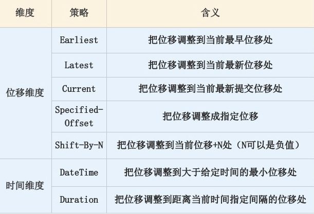

## Kafka调优

- 基于Key来生产消息的业务，不可动态调整分区数量，这将打破其原有hash算法的结果，导致消息顺序无法保证（当然业务场景可以的话，是没关系的）

- 同一Partition，如果存在未ACK的offset，在消费者未重启的情况下，消费者不会自动重新消费未提交ACK的offset；

  如果消费者重启了，那么会从未ACK的offset处继续往后执行，但是这里一个问题，如果在该Partition上后续有一个高于这个未ACK的offset的偏移量成功ACK，

  那么该Partition之前未ACK的所有记录都会丢失，已这次成功ACK的offset为最新偏移量，意味着未ACK的部分数据丢失


##### 估算Kafka分区数

一般根据未来1到2年的目标吞吐量来设计kafka的分区数量

- 基于生产消费的吞吐量进行估算
  - 假设对于单个partition，producer端的可达吞吐量为p，Consumer端的可达吞吐量为c，期望的目标吞吐量为t，那么集群所需要的partition数量至少为max(t/p,t/c)
  - 在producer端，单个分区的吞吐量大小会受到批量大小、数据压缩方法、 确认类型（同步/异步）、复制因子等配置参数的影响


业务初期，可以多配置分区数，少部署Broker数量，这样后续业务增长，我们只需添加Broker数量，然后以**在线方式**将适当比例的partition转移到新增加的broker中去


**越多的分区需要打开更多地文件句柄**

- 每个分区都会对照着文件系统的一个目录
- 每个日志数据段都会分配两个文件，一个索引文件和一个数据文件
- 机器的文件句柄可配置依据机器性能，**配置十万、百万级别**（ulimit -n）
- 文件系统类型：官网的测试报告，XFS的性能要强于ext4
- swap的调优：禁用或者设置很小的值（能够观测到Broker性能开始出现急剧下降）


##### 规划磁盘容量

- 新增消息数  ： 每天1亿
- 消息留存时间 ： 14天
- 平均消息大小  ： 1KB
- 备份数 ： 共2份数据
- 是否启用压缩 ：假设压缩比是0.75

1亿 * 1KB * 2 / 1000 / 1000 = 200GB

索引存储等其他数据存储，故再为这些数据预留出10%的磁盘空间，所以总容量为220GB

保存两周：220GB * 14，大约3TB左右

压缩后：0.75 * 3 = 2.25TB。

**kafka-log-dirs脚本是比较新的脚本，可以帮助查询各个Broker上的各个日志路径的磁盘占用情况。**


##### 带宽（评估机器数量）

- 1Gbps的千兆网络
- 10Gbps的万兆网络
- 目标：在1小时内处理1TB的业务数据， 需要多少台Kafka服务器来完成（假设带宽是1Gbps， 即每秒处理1Gb的数据，注意是小b）
  - kafka独占一台机器
  - 最大带宽：单个kafka只能占用机器的70%带宽资源（超过70%的阈值就有网络丢包的可能性）：单台Kafka服务器最多也就能使用大约700Mb的带宽资源
  - 保留带宽：（不能让Kafka服务器常规性使用这么多资源）
    - 额外预留出2/3（保守值）的资源，单台服务器使用带宽700Mb / 3 ≈ 240Mbps
  - 1小时内处理1TB：1024 * 1024 * 8 Mb / (60 * 60) s ≈ 2336Mbps
  - 2336Mbps /  240Mbps ≈ 10台


##### Rebalance触发条件

- 组成员数量发生变化

  - session.timeout.ms

  - heartbeat.interval.ms

  - max.poll.interval.ms

  - GC参数

  - 当Consumer Group完成Rebalance之后，每个Consumer实例都会定期地向Coordinator发送心跳请求，表明它还存活着。如果某个Consumer实例不能及时地发送这些心跳请求，Coordinator就会认为该Consumer已经“死”了，从而将其从Group中移除，然后开启新一轮Rebalance。Consumer端有个参数，叫session.timeout.ms，就是被用来表征此事的。该参数的默认值是10秒，即如果Coordinator在10秒之内没有收到Group下某Consumer实例的心跳，它就会认为这个Consumer实例已经挂了。可以这么说，session.timout.ms决定了Consumer存活性的时间间隔。

    除了这个参数，Consumer还提供了一个允许你控制发送心跳请求频率的参数，就是heartbeat.interval.ms。这个值设置得越小，Consumer实例发送心跳请求的频率就越高。频繁地发送心跳请求会额外消耗带宽资源，但好处是能够更加快速地知晓当前是否开启Rebalance，因为，目前Coordinator通知各个Consumer实例开启Rebalance的方法，就是将REBALANCE_NEEDED标志封装进心跳请求的响应体中。

    除了以上两个参数，Consumer端还有一个参数，用于控制Consumer实际消费能力对Rebalance的影响，即max.poll.interval.ms参数。它限定了Consumer端应用程序两次调用poll方法的最大时间间隔。它的默认值是5分钟，表示你的Consumer程序如果在5分钟之内无法消费完poll方法返回的消息，那么Consumer会主动发起“离开组”的请求，Coordinator也会开启新一轮Rebalance。

- 订阅主题数量发生变化

- 订阅主题的分区数发生变化


##### auto.offset.reset

当consumer启动后它会从Kafka读取它上次消费的位移。

- 情况1： 如果 Kafka broker端没有保存这个位移值，那么consumer会看auto.offset.reset的脸色

- 情况2：consumer拿到位移值开始消费，如果后面发现它要读取消息的位移在Kafka中不存在（可能对应的消息已经被删除了），那么它也会看auto.offset.reset的脸色

- 情况3：除以上这两种情况之外consumer不会再顾忌auto.offset.reset的值

怎么看auto.offset.reset的脸色呢？简单说就是earliest从头消息；latest从当前新位移处消费。


##### 位移提交

位移提交的语义保障是由你来负责的，Kafka只会“无脑”地接受你提交的位移

从用户的角度来说，位移提交分为自动提交和手动提交；从Consumer端的角度来说，位移提交分为同步提交和异步提交

使用KafkaConsumer.seek可以精确控制你要开始消费的位移

standalone consumer没有rebalance，也没有group提供的负载均衡，你需要自己实现。其他方面（比如位移提交）和group没有太大的不同


##### 预防CommitFailedException

- 缩短单条消息处理时间 - 优化业务代码
- 增加Consumer端允许下游系统消费一批消息的最大时长（max.poll.interval.ms：默认值是5分钟）
- 减少下游系统一次消费的消息总数（max.poll.records）
- 下游系统使用多线程加速消费


##### 消费者TCP连接

- 第一类连接：确定协调者和获取集群元数据。
  - 一个，初期的时候建立，当第三类连接建立起来之后，这个连接会被关闭。

- 第二类连接：连接协调者，令其执行组成员管理操作。
  - 一个

- 第三类连接：执行实际的消息获取。
  - 两个分别会跟两台broker机器建立一个连接，总共两个TCP连接，同一个broker机器的不同分区可以复用一个socket。


##### 消费者监控指标

- Lag：指消费者当前落后于生产者的程度
  - Kafka监控Lag的层级是在分区上的。如果要计算主题级别的，你需要手动汇总所有主题分区的Lag，将它们累加起来，合并成最终的Lag值。
  - 监控到Lag越来越大，那就是消费者程序变得越来越慢了，或者生产速度变快了
- Lead：指消费者最新消费消息的位移与分区当前第一条消息位移的差值
  - 一旦你监测到Lead越来越小，甚至是快接近于0了，你就一定要小心了，这可能预示着消费者端要丢消息了。


##### 位移删除

Empty状态（消费者组状态机）下的组Kafka才会执行过期位移删除的操作


##### 消费者组状态机

5种状态： Empty、Dead、PreparingRebalance、CompletingRebalance和Stable


##### Kafka控制器

控制器组件（Controller）：主要作用是在Apache ZooKeeper的帮助下管理和协调整个Kafka集群

- 控制器选主：基于Zookeepr进行leader选举
- 功能：
  - 主题管理（创建、删除、增加分区） - 当我们执行kafka-topics脚本时，大部分的后台工作都是控制器来完成的
  - 分区重分配 - kafka-reassign-partitions脚本
  - Preferred领导者选举 - 为了避免部分Broker负载过重而提供的一种换Leader的方案
  - 集群成员管理（新增Broker、Broker主动关闭、Broker宕机） - 监听Watch检测zookeeper的/brokers/ids节点下的子节点数量变更
  - 数据服务 - 向其他Broker提供数据服务（。控制器上保存了最全的集群元数据信息）


##### Kafka动态配置

- 动态调整Broker端各种线程池大小，实时应对突发流量。
- 动态调整Broker端连接信息或安全配置信息。
- 动态更新SSL Keystore有效期。
- 动态调整Broker端Compact操作性能。
- 实时变更JMX指标收集器(JMX Metrics Reporter)。


##### 重置消费者位移

1. 位移维度。这是指根据位移值来重设。也就是说，直接把消费者的位移值重设成我们给定的位移值。
2. 时间维度。我们可以给定一个时间，让消费者把位移调整成大于该时间的最小位移；也可以给出一段时间间隔，比如30分钟前，然后让消费者直接将位移调回30分钟之前的位移值。



可通过Api或命令行方式设置：

- 消费者Api：比较复杂
- 命令行方式：简单便捷


##### 客户端与Kafka版本是否适配

kafka-broker-api-versions脚本。**这个脚本的主要目的是验证不同Kafka版本之间服务器和客户端的适配性**

结果中：*Produce(0): 0 to 7 [usable: 7]*

- “Produce”表示Produce请求

- “0 to 7”表示Produce请求在Kafka 2.2中总共有8个版本，序号分别是0到7
  - “usable：7”表示当前连入这个Broker的客户端API能够使用的版本号是7，即最新的版本。
- **自0.10.2.0版本开始，Kafka正式支持双向兼容，也就是说，低版本的Broker也能处理高版本Client的请求了**


##### 查看Kafka日志文件数据长什么样

```shell
bin/kafka-dump-log.sh --files ../data_dir/kafka_1/test-topic-1/00000000000000000000.log --deep-iteration --print-data-log
```


##### 生产者性能测试（kafka-producer-perf-test.sh）

```shell
# 发送一千万数据，每个数据大小是1KB
$ bin/kafka-producer-perf-test.sh --topic test-topic --num-records 10000000 --throughput -1 --record-size 1024 --producer-props bootstrap.servers=kafka-host:port acks=-1 linger.ms=2000 compression.type=lz4

# 生产者吞吐量、消息发送延时、各种分位数下的延时（SLA ： 604 ms 99th ： 有99%消息的延时都在604ms以内）
2175479 records sent, 435095.8 records/sec (424.90 MB/sec), 131.1 ms avg latency, 681.0 ms max latency.
4190124 records sent, 838024.8 records/sec (818.38 MB/sec), 4.4 ms avg latency, 73.0 ms max latency.
10000000 records sent, 737463.126844 records/sec (720.18 MB/sec), 31.81 ms avg latency, 681.00 ms max latency, 4 ms 50th, 126 ms 95th, 604 ms 99th, 672 ms 99.9th.
```


##### 消费者性能测试（kafka-consumer-perf-test.sh）

```shell
$ bin/kafka-consumer-perf-test.sh --broker-list kafka-host:port --messages 10000000 --topic test-topic

# 消费者吞吐量
start.time, end.time, data.consumed.in.MB, MB.sec, data.consumed.in.nMsg, nMsg.sec, rebalance.time.ms, fetch.time.ms, fetch.MB.sec, fetch.nMsg.sec
2019-06-26 15:24:18:138, 2019-06-26 15:24:23:805, 9765.6202, 1723.2434, 10000000, 1764602.0822, 16, 5651, 1728.1225, 1769598.3012
```


##### 分区副本迁移（kafka-reassign-partitions.sh）


##### Kafka集群间的数据同步（kafka-mirror-maker.sh）

MirrorMaker就是一个消费者+生产者的程序。消费者负责从源集群（Source Cluster）消费数据，生产者负责向目标集群（Target Cluster）发送消息

```shell
# 它的常见用法是指定生产者配置文件、消费者配置文件、线程数(消费者个数)以及要执行数据镜像的主题正则表达式
$ bin/kafka-mirror-maker.sh --consumer.config ./config/consumer.properties --producer.config ./config/producer.properties --num.streams 8 --whitelist ".*"
```

**注意点：MirrorMaker在执行消息镜像的过程中，如果发现要同步的主题在目标集群上不存在的话，它就会根据Broker端参数num.partitions和default.replication.factor的默认值，自动将主题创建出来，在实际使用场景中，我推荐你提前把要同步的所有主题按照源集群上的规格在目标集群上等价地创建出来。**

除了常规的Kafka主题之外，MirrorMaker默认还会同步内部主题。

其他开源方案：

- [Uber的uReplicator工具](https://github.com/uber/uReplicator)
- LinkedIn开发的Brooklin Mirror Maker工具
- Confluent公司研发的Replicator工具（收费）

MirrorMaker本身功能简单，应用灵活，但也有运维成本高、性能差等劣势，因此业界有厂商研发了自己的镜像工具。你可以根据自身的业务需求，选择合适的工具来帮助你完成跨集群的数据备份。


##### Kafka监控

- 主机监控（机器性能）

  - 机器负载（Load）
  - CPU使用率
  - 内存使用率，包括空闲内存（Free Memory）和已使用内存（Used Memory）
  - 磁盘I/O使用率，包括读使用率和写使用率
  - 网络I/O使用率
  - TCP连接数
  - 打开文件数
  - inode使用情况

- JVM监控

  - Full GC发生频率和时长。这个指标帮助你评估Full GC对Broker进程的影响。长时间的停顿会令Broker端抛出各种超时异常。
  - 活跃对象大小。这个指标是你设定堆大小的重要依据，同时它还能帮助你细粒度地调优JVM各个代的堆大小。
  - 应用线程总数。这个指标帮助你了解Broker进程对CPU的使用情况。
  - 具体：**你一定要监控你的Broker GC日志，即以kafkaServer-gc.log开头的文件**，注意不要出现Full GC的字样。一旦你发现Broker进程频繁Full GC，可以开启G1的-XX:+PrintAdaptiveSizePolicy开关，让JVM告诉你到底是谁引发了Full GC。

- 集群监控

  - 查看Broker进程是否启动，端口是否建立
    - 在很多容器化的Kafka环境中，比如使用Docker启动Kafka Broker时，容器虽然成功启动了，但是里面的网络设置如果配置有误，就可能会出现进程已经启动但端口未成功建立监听的情形
  - 查看Broker端关键日志
    - 服务器日志server.log（最重要的：严重错误都会在这个文件中被展示出来）
    - 控制器日志controller.log
    - 主题分区状态变更日志state-change.log
  - 查看Broker端关键线程的运行状态
    - Log Compaction线程，这类线程是以kafka-log-cleaner-thread开头的
    - 副本拉取消息的线程，通常以ReplicaFetcherThread开头
  - 查看Broker端的关键JMX指标（Kafka提供了超多的JMX指标供用户实时监测）
    - **BytesIn/BytesOut**：即Broker端每秒入站和出站字节数。你要确保这组值不要接近你的网络带宽，**否则这通常都表示网卡已被“打满”，很容易出现网络丢包的情形。**
    - **NetworkProcessorAvgIdlePercent**：即网络线程池线程平均的空闲比例。通常来说，你应该确保这个JMX值长期大于30%。如果小于这个值，就表明你的网络线程池非常繁忙，你需要通过增加网络线程数或将负载转移给其他服务器的方式，来给该Broker减负。
    - **RequestHandlerAvgIdlePercent**：即I/O线程池线程平均的空闲比例。同样地，如果该值长期小于30%，你需要调整I/O线程池的数量，或者减少Broker端的负载。
    - **UnderReplicatedPartitions**：即未充分备份的分区数。所谓未充分备份，是指并非所有的Follower副本都和Leader副本保持同步。一旦出现了这种情况，通常都表明该分区有可能会出现数据丢失。因此，这是一个非常重要的JMX指标。
    - **ActiveControllerCount**：即当前处于激活状态的控制器的数量。正常情况下，Controller所在Broker上的这个JMX指标值应该是1，其他Broker上的这个值是0。如果你发现存在多台Broker上该值都是1的情况，一定要赶快处理，处理方式主要是查看网络连通性。这种情况通常表明集群出现了脑裂。脑裂问题是非常严重的分布式故障，Kafka目前依托ZooKeeper来防止脑裂。但一旦出现脑裂，Kafka是无法保证正常工作的。
    - 还可以根据自己业务的需要，去官网查看其他JMX指标，把它们集成进你的监控框架
  - 监控Kafka客户端

- 监控框架：

  - JMXTool

    - ```shell
      # 查看使用方法
      $ bin/kafka-run-class.sh kafka.tools.JmxTool
      ```

    - --attributes：指定要查询的JMX属性名称，以逗号分割的csv格式

    - --date-format：指定显示的日期格式

    - --jmx-url：指定要连接的jmx接口，默认格式为：service:jmx:rmi:///jndi/rmi:<JMX端口>/jmxrmi

    - --object-name：指定要查询的JMX MBean的名称

    - --reporting-interval：指定实时查询的时间间隔，默认2秒查询一次

    - ```shell
      # Demo：每5秒查询一次过去1分钟的BytesInPerSec均值（Broker端每秒入站的流量）
      $ bin/kafka-run-class.sh kafka.tools.JmxTool --object-name kafka.server:type=BrokerTopicMetrics,name=BytesInPerSec --jmx-url service:jmx:rmi:///jndi/rmi://:9997/jmxrmi --date-format "YYYY-MM-dd HH:mm:ss" --attributes OneMinuteRate --reporting-interval 1000
      ```

  - Kafka Manager

  - Burrow

  - JMXTrans + InfluxDB + Grafana（流行）

  - Kafka Eagle


#####  Kafka调优

高吞吐量、低延时是我们调优Kafka集群的主要目标

- vm.max_map_count=655360：避免**OutOfMemoryError：Map failed**
- 操作系统页缓存大小：给Kafka预留的页缓存越大越好，最小值至少要容纳一个日志段的大小，也就是Broker端参数log.segment.bytes的值，该参数的默认值是1GB
- 设置堆大小：你可以查看GC log，特别是关注Full GC之后堆上存活对象的总大小，然后把堆大小设置为该值的1.5～2倍，如果你发现Full GC没有被执行过，手动运行jmap -histo:live < pid >就能人为触发Full GC。
- 调节吞吐量
- 调节延时