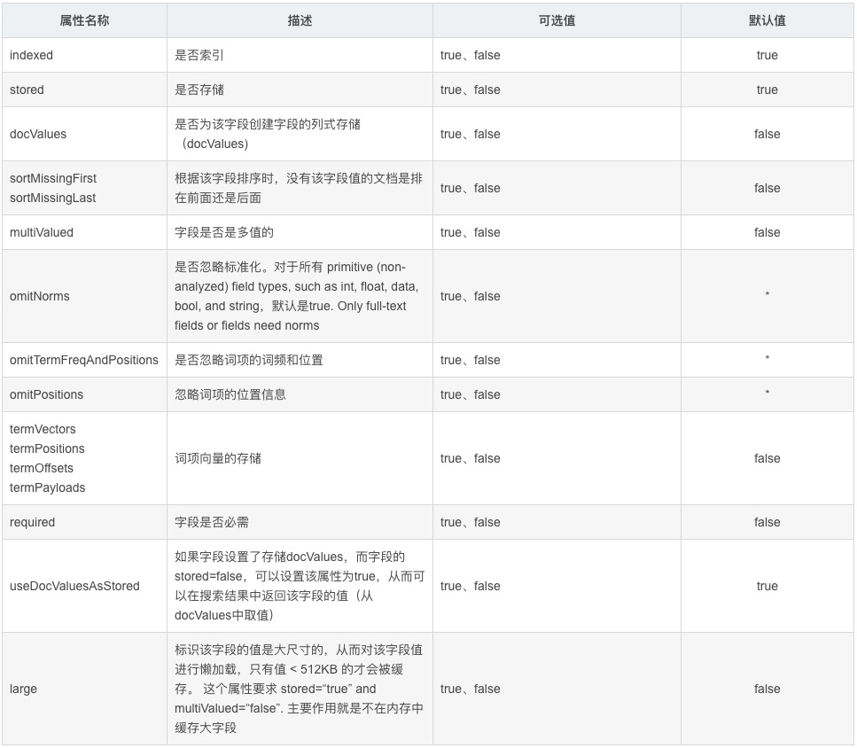

## Solr

##### [Solr with HDFS](https://lucene.apache.org/solr/guide/7_3/running-solr-on-hdfs.html)

- This does not use Hadoop MapReduce to process Solr data, 

- it only uses the HDFS filesystem for index and transaction log file storage. 
- To use Hadoop MapReduce to process Solr data, see the MapReduceIndexerTool in the Solr contrib area. 
- must be using Hadoop 2.x 
- need to instruct Solr to use the `HdfsDirectoryFactory`.


只是存储数据到HDFS，数据还是Solr Data形式

通过MR批量创建索引

Spark读取Solr数据


##### 性能

- If you are looking for the best performance with the fewest variations, then SSDs and ample memory is where you should be looking.

- Solr on HDFS can perform just as well as local disks given the right amount of memory.
- For large scale analytics then Solr on HDFS performs well
- For high speed indexing then you will need SSDs since the write performance of Solr on HDFS is not going to match


##### HDFS Block Cache 调优


```
// Standalone mode
bin/solr start -Dsolr.directoryFactory=HdfsDirectoryFactory
     -Dsolr.lock.type=hdfs
     -Dsolr.data.dir=hdfs://host:port/path
     -Dsolr.updatelog=hdfs://host:port/path
     
// SolrCloud mode (基于Solr和Zookeeper的分布式搜索方案)
bin/solr start -c -Dsolr.directoryFactory=HdfsDirectoryFactory
     -Dsolr.lock.type=hdfs
     -Dsolr.hdfs.home=hdfs://host:port/path
     
// The Block Cache     
-XX:MaxDirectMemorySize=20g   
// solr.hdfs.confdir=?? : Pass the location of HDFS client configuration files - needed for HDFS HA for example.
// 其他参考官方文档(https://lucene.apache.org/solr/guide/6_6/running-solr-on-hdfs.html)
```


##### 使用

- 定义Schema
  - 告诉Solr你要索引的文档的Field构成
- 数据发送给Solr
  - DB -> Solr
- 公开搜索：使用Solr API

内嵌Jetty服务

> In Solr, unless otherwise specified, all units of distance are kilometers and points are in degrees of latitude and longitude.
>
> 在Solr里面，除非特殊声明，所有的距离都是千米，索引的点都是精度和维度


##### Solr Core

运行在Solr服务器中的具体唯一命名的，可管理和配置的索引 (针对不同文档，业务需求，定义不同内核用于索引和存储)


##### 服务规模考量


##### Field (https://blog.csdn.net/supermao1013/article/details/83628344)




##### Field Type

```
<fieldType name="string" class="solr.StrField" sortMissingLast="true" docValues="true" />
<fieldType name="boolean" class="solr.BoolField" sortMissingLast="true"/>
<fieldType name="text_ws" class="solr.TextField" positionIncrementGap="100">
  <analyzer>
      <tokenizer class="solr.WhitespaceTokenizerFactory"/>
  </analyzer>
</fieldType>
```

> - name：字段类型名称，用于Field定义中的type属性引用
> - class：存放该类型的值来进行索引的字段类名（同lucene中Field的子类）。注意，应以 *solr.*为前缀，这样solr就可以很快定位到该到哪个包中去查找类，如 solr.TextField 。如果使用的是第三方包的类，则需要用全限定名。solr.TextField 的全限定名为：org.apache.solr.schema.TextField。
> - positionIncrementGap：用于多值字段，定义多值间的间隔，来阻止假的短语匹配
> - autoGeneratePhraseQueries：用于文本字段，如果设为true，solr会自动对该字段的查询生成短语查询，即使搜索文本没带“”
> - synonymQueryStyle：同义词查询分值计算方式
> - enableGraphQueries：是否支持图表查询
> - docValuesFormat：docValues字段的存储格式化器：schema-aware codec，配置在solrconfig.xml中的
>
> - postingsFormat：词条格式器：schema-aware codec，配置在solrconfig.xml中的

**Solr中提供的 FieldType 类，在 org.apache.solr.schema 包下**

Solr自带的FieldType查看：(http://lucene.apache.org/solr/guide/7_5/field-types-included-with-solr.html)


#### 索引

##### 新增

solr-admin-web -> collection -> Documents -> JSON

[**索引中无则新增,有则更新**]

```xml
// 增加权重（boost），增加权重后，可以在搜索的时候做权重过滤
<add>
  <doc boost="2.5">
    <field name="gameId">05991</field>
    <field name="gameName" boost="2.0">angrybird</field>
  </doc>
</add>
```


##### 删除

```xml
<delete><id>1</id></delete>
<commit/>

<delete><query>id:1</query></delete>
<commit/>

// 删除所有索引
<delete><query>*:*</query></delete>
<commit/>

{delete:{query:"*:*"}}
```


##### 问题

无权限控制，需自行在业务中添加字段来分权限 (对比ES的多租户)


### 参考：

[Idea导入源码](https://blog.csdn.net/sweety820/article/details/74347068)

[源码分析](https://blog.csdn.net/conansonic/article/details/52388859)

[Solr with HDFS](https://lucene.apache.org/solr/guide/6_6/running-solr-on-hdfs.html)

[Solr on HDFS最佳实践](https://risdenk.github.io/2018/10/23/apache-solr-running-on-apache-hadoop-hdfs.html)